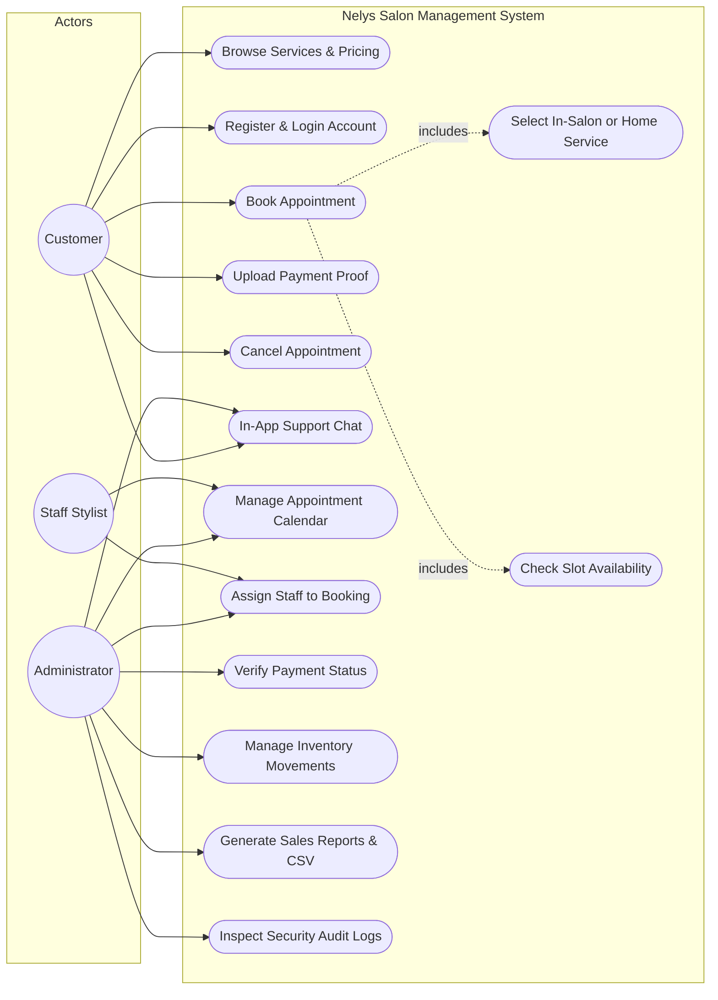
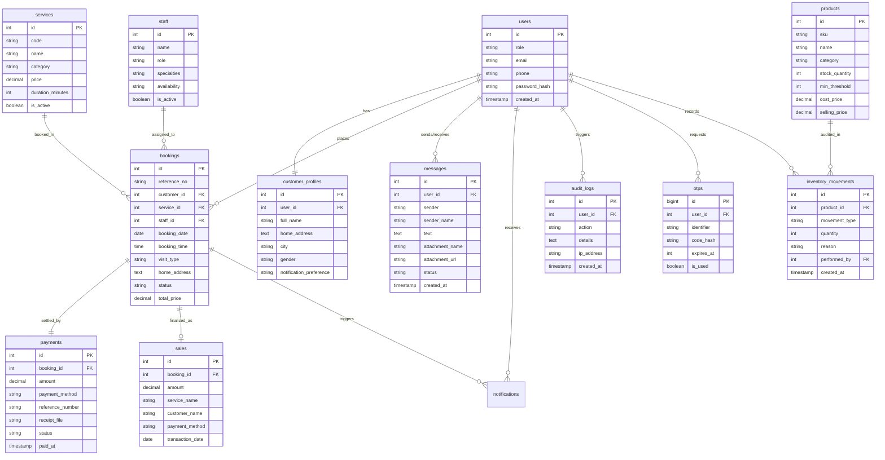

# PROJECT DOCUMENTATION PAPER

## PROPOSED PROJECT TITLES

1. **(Recommended Academic / Capstone Title)**  
   **"Nely’s Salon Management System: A Web-Based Appointment Scheduling, Inventory Tracking, and Customer Service Platform for Local Beauty and Wellness Enterprises"**

2. **(Alternative Software Engineering Title)**  
   **"Design and Implementation of a Responsive Multi-Tier Salon Management System with In-Salon and Home-Service Booking, Real-Time Messaging, and Sales Analytics"**

3. **(Alternative Business & Operations Title)**  
   **"Digital Transformation of MSME Beauty Salons: An Integrated Web Application for Automated Appointment Scheduling, Audited Stock Ledger, and Financial Reporting"**

---

**Prepared For:** Nely’s Salon  
**Location:** BLK 42 Lot 59 Ascension Rd, Lagro, Quezon City, Metro Manila, Philippines  
**Target Platform:** Cross-Platform Responsive Web Application (Mobile Phone, Tablet, & Desktop Browser)  
**Technology Stack:** PHP 8.1+ (MVC Architecture), MySQL 8.0, Modern JavaScript (ES6+), HTML5, Tailwind CSS v4, Font Awesome 6  
**Document Status:** Complete Capstone & Project Documentation Paper (Chapters 1 to 6)  
**Date:** October 2026  

---

## TABLE OF CONTENTS

- [CHAPTER 1 — INTRODUCTION](#chapter-1--introduction)
  - [1.1 Background of the Study](#11-background-of-the-study)
  - [1.2 Company/Business Profile](#12-companybusiness-profile)
  - [1.3 Problem Statement](#13-problem-statement)
  - [1.4 General Problem](#14-general-problem)
  - [1.5 Specific Problems](#15-specific-problems)
  - [1.6 Objectives of the System](#16-objectives-of-the-system)
    - [1.6.1 General Objective](#161-general-objective)
    - [1.6.2 Specific Objectives](#162-specific-objectives)
  - [1.7 Significance of the Study](#17-significance-of-the-study)
  - [1.8 Scope and Limitations](#18-scope-and-limitations)
  - [1.9 Definition of Terms](#19-definition-of-terms)
- [CHAPTER 2: REVIEW OF RELATED LITERATURE AND SYSTEMS](#chapter-2-review-of-related-literature-and-systems)
  - [2.1 Theoretical Framework and Concepts](#21-theoretical-framework-and-concepts)
  - [2.2 Review of Related Literature](#22-review-of-related-literature)
  - [2.3 Review of Related Systems (Comparative Analysis)](#23-review-of-related-systems-comparative-analysis)
  - [2.4 Synthesis and Gap Analysis](#24-synthesis-and-gap-analysis)
- [CHAPTER 3 — SYSTEM ANALYSIS AND DESIGN](#chapter-3--system-analysis-and-design)
  - [3.1 Development Methodology](#31-development-methodology)
  - [3.2 System Requirements](#32-system-requirements)
    - [3.2.1 Functional Requirements](#321-functional-requirements)
    - [3.2.2 Non-Functional Requirements](#322-non-functional-requirements)
  - [3.3 User Roles](#33-user-roles)
    - [3.3.1 Customer](#331-customer)
    - [3.3.2 Administrator](#332-administrator)
  - [3.4 System Features](#34-system-features)
  - [3.5 System Flow](#35-system-flow)
  - [3.6 Use Case Diagram](#36-use-case-diagram)
  - [3.7 Use Case Description](#37-use-case-description)
  - [3.8 Data Flow Diagram](#38-data-flow-diagram)
  - [3.9 Entity Relationship Diagram](#39-entity-relationship-diagram)
  - [3.10 Database Design](#310-database-design)
  - [3.11 System Architecture](#311-system-architecture)
  - [3.12 Navigation Flow](#312-navigation-flow)
- [CHAPTER 4 — SYSTEM DEVELOPMENT AND IMPLEMENTATION](#chapter-4--system-development-and-implementation)
  - [4.1 Development Environment](#41-development-environment)
    - [4.1.1 Hardware Requirements](#411-hardware-requirements)
    - [4.1.2 Software Requirements](#412-software-requirements)
  - [4.2 Technologies Used](#42-technologies-used)
    - [HTML](#html)
    - [Tailwind CSS](#tailwind-css)
    - [JavaScript](#javascript)
    - [PHP/MySQL (if applicable)](#phpmysql-if-applicable)
  - [4.3 User Interface Design](#43-user-interface-design)
  - [4.4 Customer Module](#44-customer-module)
    - [4.4.1 Customer Landing Page](#441-customer-landing-page)
    - [4.4.2 Customer Registration](#442-customer-registration)
    - [4.4.3 Customer Login](#443-customer-login)
    - [4.4.4 Customer Dashboard](#444-customer-dashboard)
    - [4.4.5 Services and Pricing](#445-services-and-pricing)
    - [4.4.6 Book Appointment](#446-book-appointment)
    - [4.4.7 Appointment History](#447-appointment-history)
    - [4.4.8 Customer Profile](#448-customer-profile)
    - [4.4.9 Messages](#449-messages)
  - [4.5 Administrator Module](#45-administrator-module)
    - [4.5.1 Admin Login](#451-admin-login)
    - [4.5.2 Admin Dashboard](#452-admin-dashboard)
    - [4.5.3 Customer Management](#453-customer-management)
    - [4.5.4 Services Management](#454-services-management)
    - [4.5.5 Appointment Management](#455-appointment-management)
    - [4.5.6 Appointment Approval/Confirmation](#456-appointment-approvalconfirmation)
    - [4.5.7 Messages](#457-messages)
    - [4.5.8 Reports](#458-reports)
    - [4.5.9 Admin Profile/Settings](#459-admin-profilesettings)
  - [4.6 Communication Module](#46-communication-module)
    - [4.6.1 Customer-to-Admin Messaging](#461-customer-to-admin-messaging)
    - [4.6.2 Admin-to-Customer Messaging](#462-admin-to-customer-messaging)
  - [4.7 Appointment Management Process](#47-appointment-management-process)
  - [4.8 Database Implementation](#48-database-implementation)
  - [4.9 Security Features](#49-security-features)
  - [4.10 System Deployment](#410-system-deployment)
- [CHAPTER 5 — TESTING AND EVALUATION](#chapter-5--testing-and-evaluation)
  - [5.1 Testing Methodology](#51-testing-methodology)
  - [5.2 Test Environment](#52-test-environment)
  - [5.3 Functional Testing](#53-functional-testing)
  - [5.4 User Interface Testing](#54-user-interface-testing)
  - [5.5 Login and Authentication Testing](#55-login-and-authentication-testing)
  - [5.6 Appointment Testing](#56-appointment-testing)
  - [5.7 Messaging Testing](#57-messaging-testing)
  - [5.8 Database Testing](#58-database-testing)
  - [5.9 Compatibility Testing](#59-compatibility-testing)
  - [5.10 User Acceptance Testing](#510-user-acceptance-testing)
  - [5.11 Testing Results](#511-testing-results)
- [CHAPTER 6: SUMMARY, CONCLUSIONS, AND RECOMMENDATIONS](#chapter-6-summary-conclusions-and-recommendations)
  - [6.1 Summary of Findings](#61-summary-of-findings)
  - [6.2 Conclusions](#62-conclusions)
  - [6.3 Recommendations for Future Work](#63-recommendations-for-future-work)
- [REFERENCES](#references)

---

# CHAPTER 1 — INTRODUCTION

## 1.1 Background of the Study

The personal care, wellness, and beauty service industry represents one of the most vital and resilient segments of the micro, small, and medium enterprise (MSME) sector in the Philippines. Characterized by personalized human craftsmanship, high repeat-customer loyalty, and labor-intensive service delivery, local salons serve as essential neighborhood hubs catering to personal grooming, professional styling, and wellness needs. In urban and suburban communities throughout Metro Manila—such as Novaliches and Fairview in Quezon City—neighborhood salons thrive by fostering direct, personal relationships with their clientele.

Despite the industry's steady demand, the operational framework of traditional community salons has historically remained manual. For decades, beauty salons relied upon paper logbooks, wall calendars, handwritten index cards for client history, and direct telephone calls or walk-in arrivals to coordinate daily schedules. While these traditional practices sufficed during lower volume periods, the rapid acceleration of the digital economy following the COVID-19 pandemic fundamentally shifted consumer expectations. Today's customers increasingly demand 24/7 self-service convenience: the ability to browse service catalogs from their smartphones, view transparent and upfront pricing, schedule appointments on demand, select preferred payment methods (such as cash, GCash, or mobile bank transfers), receive automated appointment reminders, and request home-service beauty care without the friction of telephone calls or waiting in physical queues.

Simultaneously, manual salon operations expose enterprise owners to severe operational vulnerabilities. The absence of synchronized scheduling frequently produces double-booked appointment slots, peak-hour customer crowding, and stylist schedule overlaps. The lack of an audited inventory tracking system leaves expensive chemical treatments (such as Brazilian blowout solutions, bleaching powders, peroxides, and premium keratin treatments) vulnerable to stockouts, wastage, and untracked shrinkage. Furthermore, paper-based or spreadsheet-based financial tracking introduces human mathematical errors and makes past revenue records susceptible to tampering or unintentional distortion whenever salon service prices are updated.

To bridge the gap between traditional craftsmanship and modern operational efficiency, information technology must be leveraged to create custom, web-based management solutions tailored to the practical realities of Philippine beauty MSMEs. By deploying a responsive, multi-tier web application, community salons can eliminate scheduling bottlenecks, protect inventory assets, safeguard historical financial data, and provide a seamless, premium self-service experience to their growing customer base.

---

## 1.2 Company/Business Profile

| Enterprise Detail | Profile Information |
|---|---|
| **Business Name** | **Nely’s Salon** |
| **Business Slogan / Motto** | **"Your Beauty Is Our Duty"** |
| **Establishment & History** | Over **15 Years** of continuous, trusted beauty and wellness service |
| **Physical Address** | **BLK 42 Lot 59 Ascension Road, Lagro, Quezon City, Metro Manila, Philippines** |
| **Operating Hours** | Monday to Sunday: 9:00 AM – 8:00 PM |
| **Service Delivery Modalities** | **In-Salon Appointments** & **Home-Service Beauty Care** |
| **Target Market** | Residents, working professionals, students, and families in Greater Lagro, Fairview, Novaliches, and nearby Quezon City communities |
| **Ownership & Management** | Owner-operated with a dedicated team of professional senior hair stylists, colorists, and nail technicians |

Nely’s Salon was established in Lagro, Quezon City, with the mission of delivering accessible, premium-quality beauty and hair care rooted in warmth, cleanliness, and personalized customer attention. Over its fifteen (15) years of trusted community service, the salon has developed a comprehensive catalog comprising thirteen (13) core treatments organized into two primary divisions:

1. **Hair Care & Chemical Treatments:**
   - *Brazilian Blowout* (₱1,999) — Intensive smoothing and protein revitalization treatment
   - *Hair Dye / Coloring* (₱699) — Full-coverage fashion and grey-blending hair color
   - *Cold Wave Perm* (₱699) — Classical chemical curling and texturizing treatment
   - *Power Dose* (₱499) — Deep-penetrating concentrated hair repair ampoule treatment
   - *Bonacure Treatment* (₱499) — Cell-repair peptide therapy for damaged and color-treated hair
   - *Keratine Treatment* (₱499) — Frizz-control smoothing and conditioning treatment
   - *Hair Trim* (₱149) — Precision dry or wet haircutting and split-end maintenance
   - *Hair Rebonding* — Permanent thermal and chemical hair straightening therapy
2. **Nail & Foot Care Services:**
   - *Footspa* (₱199) — Exfoliating foot soak, scrub, calloused skin softening, and massage
   - *Gel Manicure* (₱499) — Long-lasting UV/LED cured gel nail polish application
   - *Gel Pedicure* (₱499) — Long-lasting UV/LED cured toenail polish with grooming
   - *Standard Manicure* (₱149) — Classical fingernail shaping, cuticle trimming, and polish
   - *Standard Pedicure* (₱149) — Classical toenail grooming, shaping, and polish

In addition to chair services conducted inside its Ascension Road salon, Nely's Salon accommodates **Home-Service appointments**, dispatching experienced stylists and technicians directly to clients' residences for weddings, special events, or personal grooming. This dual-modality operation reinforces the salon's commitment to customer convenience while requiring meticulous scheduling and destination management.

---

## 1.3 Problem Statement

Over its 15 years of successful community operation, Nely’s Salon has maintained its appointment calendar, customer inquiries, consumable supplies, and daily sales tallies primarily through paper logbooks, walk-in reception logs, and informal social media chat messages. While this traditional setup supported early operations, the increasing volume of clients, the growing popularity of mobile home-service requests, and the rise of digital payments (e.g., GCash and bank transfers) have strained the salon's operational capacity. 

Frontline staff routinely struggle with conflicting appointment requests, misplaced physical booking slips, unnotified appointment no-shows, untracked salon chemical consumption, and time-consuming end-of-day sales calculations. Consequently, salon management lacks real-time operational visibility, stylists experience unbalanced workloads, and customers face frustrating delays when seeking to confirm appointment availability.

---

## 1.4 General Problem

How to design, develop, and implement an integrated, responsive, and secure **Web-Based Salon Management System** for Nely’s Salon that transitions manual booking, inventory control, customer communication, and sales reporting into a centralized, automated digital platform supporting both in-salon visits and home-service appointments.

---

## 1.5 Specific Problems

To resolve the overarching operational challenge, the system must specifically address the following distinct problems:

1. **Appointment Scheduling Inefficiencies and Double-Booking:**  
   Clients must visit or telephone the salon during open business hours to schedule appointments. Simultaneous telephone inquiries and physical walk-ins frequently lead to double-booked time slots, overlapping stylist commitments, and prolonged client waiting times.
2. **Unstructured Home-Service Booking & Logistics:**  
   While home-service is an essential revenue stream, capturing client residential addresses, navigating destination landmarks, and scheduling travel buffers between appointments lacks a standardized, structured digital workflow.
3. **High Rate of Appointment No-Shows and Last-Minute Cancellations:**  
   Because the salon lacks an automated notification and reminder mechanism, clients frequently forget their appointments or cancel without notice, leaving scheduled stylists idle and depriving the salon of potential revenue.
4. **Unaudited Consumable Inventory & Supply Depletion:**  
   Consumable salon chemical supplies (e.g., Brazilian solutions, keratin mixtures, hair dye tubes, peroxides, and sanitizing solutions) are depleted without a formal movement tracking ledger. This results in surprise stockouts during ongoing treatments, unrecorded product wastage, and vulnerability to inventory shrinkage.
5. **Vulnerable Financial Bookkeeping & Historical Sales Price Corruption:**  
   Sales are manually calculated in physical notebooks at the end of each business day, a process prone to mathematical errors and lost transaction slips. Furthermore, modifying a service's base price in existing systems often inadvertently recalculates past historical sales, corrupting past revenue reporting.
6. **Fragmented Customer Inquiries and Unverified Payment Transfers:**  
   Customer inquiries, style preference photos, and GCash payment proof screenshots are scattered across individual staff mobile devices and private messaging threads. This prevents management from centrally tracking customer consultation histories, confirming receipt authenticity, and managing payment statuses.

---

## 1.6 Objectives of the System

### 1.6.1 General Objective

To design, develop, test, and implement a robust, responsive, and secure **Web-Based Salon Management System** for Nely’s Salon that digitizes and centralizes customer appointment scheduling, dual-modality service logistics, audited inventory management, real-time customer messaging, and financial sales analytics into a unified web application.

### 1.6.2 Specific Objectives

In fulfillment of the general objective, the system achieves the following specific technical and functional goals:

1. **Public Brand Presentation & Dynamic Service Catalog:**  
   To develop a mobile-responsive landing page showcasing Nely’s Salon’s 15-year brand identity, location details, business hours, and full 13-service catalog categorized into Hair Care and Nail/Foot Care with transparent pricing.
2. **Multi-Step Online Booking Wizard with Conflict-Prevention Engine:**  
   To construct a 6-step online appointment reservation wizard that enables customers to select treatments, designate the visit modality (In-Salon vs. Home-Service with residential address capture), pick available dates and time slots verified by an automated slot conflict checker, and receive a permanent booking reference number.
3. **Authenticated Customer Portal:**  
   To create an intuitive customer dashboard allowing registered clients to track pending and confirmed bookings, review historical service visits, update profile contact information, and initiate policy-compliant appointment cancellations.
4. **Integrated In-App Customer Support Messaging:**  
   To build a bidirectional, real-time messaging interface between clients and salon administrators with media attachment support (for sending hairstyle reference photos and GCash payment receipts) and delivery status indicators (`sent`, `delivered`, `read`).
5. **Audited Inventory Control & Reorder Alerting:**  
   To implement an inventory tracking module featuring automated SKU management, minimum stock threshold alerts, and an immutable movement ledger tracking all stock changes (`stock_in`, `stock_out`, `damaged`, `adjustment`) with user attribution and reason logging.
6. **Sales Analytics, Snapshot Pricing & Financial Reporting:**  
   To engineer an automated sales computation engine that records immutable price snapshots at booking completion, aggregates revenue across daily, weekly, monthly, and yearly intervals, breaks down earnings by service and payment method (Cash, GCash, Bank Transfer), and exports financial reports to CSV.
7. **Role-Based Security, Authentication & System Auditability:**  
   To enforce comprehensive application security using PHP MVC architecture, PDO prepared statements, Bcrypt password hashing, CSRF protection, Role-Based Access Control (RBAC), One-Time Password (OTP) verification, and automated system audit logging.

---

## 1.7 Significance of the Study

The design and implementation of the Nely’s Salon Management System delivers substantial operational, economic, and practical benefits to multiple key stakeholders:

- **To Nely’s Salon Management & Owners:**  
  Provides centralized, 360-degree operational visibility over daily salon activities. Eliminates administrative overhead, prevents double-booking errors, safeguards inventory from unrecorded shrinkage, guarantees immutable financial bookkeeping, and delivers real-time business intelligence to guide pricing and promotional strategies.
- **To Salon Stylists and Staff Members:**  
  Empowers hair stylists and nail technicians with organized, conflict-free daily appointment schedules. Eliminates confusion regarding customer arrival times and home-service destination addresses, ensures treatment supplies are fully stocked prior to service delivery, and fosters an organized, professional work environment.
- **To Customers and Clients:**  
  Grants clients 24/7 self-service convenience to explore services, verify upfront pricing, schedule in-salon or home-service appointments without phone calls, submit digital payment proofs securely, chat directly with salon staff, and receive automated reminders to prevent missed bookings.
- **To Future Researchers and Software Engineering Students:**  
  Serves as a comprehensive, real-world capstone documentation and architectural reference for developing full-stack web applications for local MSMEs. It demonstrates best practices in clean MVC PHP, Vanilla JavaScript, normalized MySQL database design (3NF), transactional integrity, and role-based security.

---

## 1.8 Scope and Limitations

### 1.8.1 Scope (Functional Modules)

The Nely’s Salon Management System encompasses nine (9) primary functional modules:

1. **User Authentication & Role-Based Access Control:**  
   - Multi-role support for Administrator, Staff, and Customer accounts.
   - User registration, secure login, profile maintenance, and One-Time Password (OTP) 2FA verification.
2. **Service Catalog & Pricing Management:**  
   - Maintenance of services, categories (Hair Services, Nail & Foot Care), prices, durations, and active statuses.
   - Price snapshot mechanism ensuring catalog modifications never alter past sales records.
3. **Online Appointment & Scheduling Wizard:**  
   - 6-step customer booking wizard (Service $\rightarrow$ Location $\rightarrow$ Slot $\rightarrow$ Details $\rightarrow$ Payment $\rightarrow$ Confirmation).
   - Real-time conflict engine preventing double-booked slots and stylist overlap.
   - Full appointment lifecycle tracking (`pending`, `confirmed`, `completed`, `cancelled`, `no_show`).
4. **Dual Visit Modalities (In-Salon & Home-Service):**  
   - Native differentiation between in-salon appointments and mobile home-service visits.
   - Dynamic destination address, barangay, city, and landmark capture for home-service bookings.
5. **Staff Directory & Workload Assignment:**  
   - Management of stylist profiles, specialties, contact details, and assignment to specific appointments.
6. **Payment Processing & Verification:**  
   - Multiple payment options: Cash on Visit, GCash, and Bank Transfer.
   - Client upload of transaction reference numbers and payment receipt screenshots with admin verification.
7. **Audited Inventory Management Ledger:**  
   - Tracking of salon consumable supplies and retail products, unit types, and reorder thresholds.
   - Audited movement ledger recording quantity changes with user ID, timestamp, and justification reason.
8. **Sales Analytics & Financial Reporting:**  
   - Automated aggregation of gross and net revenue across daily, weekly, monthly, and yearly intervals.
   - Service category and payment method breakdown analytics with one-click CSV report export.
9. **Real-Time Customer Messaging & Audit Logging:**  
   - In-app customer support chat supporting text and image attachments with message status tracking.
   - Automated system audit trail logging administrative actions, inventory edits, and IP addresses.

### 1.8.2 Limitations of the System

To maintain focus and ensure successful project execution within available time and resources, the system is bounded by the following limitations:

- **Third-Party Automated Payment Gateways:**  
  The system does not integrate automated direct-debit API payment webhooks (e.g., PayMongo or GCash Official Merchant SDK); digital payments via GCash and Bank Transfer are handled via customer reference number entry and receipt screenshot uploads verified manually by salon administrators.
- **SMS Cellular Gateway Dependencies:**  
  Automated reminders and notifications utilize in-app notification queues and standard email dispatch; direct cellular carrier SMS dispatch is dependent upon third-party SMS API credits (such as Semaphore or Twilio) and is omitted when active internet messaging is utilized.
- **Single-Branch Architecture:**  
  The current system is optimized specifically for Nely’s Salon’s flagship branch in Lagro, Quezon City; multi-branch enterprise inventory synchronization across distinct physical salon outlets is outside the current operational scope.
- **Exclusion of Hardware Biometrics:**  
  Staff attendance and shift tracking are handled through system logins and administrative status updates rather than physical biometric fingerprint or facial recognition hardware scanners.

---

## 1.9 Definition of Terms

To facilitate clear understanding, the following operational and technical terms are defined:

- **Appointment Slot:** A discrete block of operating time (e.g., 60 minutes) allocated to a specific customer, service, and stylist to prevent overlapping engagements.
- **Audit Log:** An immutable, time-stamped record detailing administrative system actions, inventory movements, status updates, and user IP addresses for security compliance.
- **Bcrypt:** An adaptive cryptographic password-hashing algorithm based on the Blowfish cipher used to securely hash and store user credentials.
- **Booking Reference Number:** A unique, system-generated alphanumeric identifier (e.g., `BK-202610-042`) assigned to each appointment for tracking, verification, and payment lookup.
- **Cross-Site Request Forgery (CSRF):** A web security vulnerability mitigated in this system through server-generated cryptographic nonces validated on every state-altering HTTP request.
- **Customer Portal:** An authenticated, self-service web interface enabling registered clients to manage profile information, monitor appointment statuses, upload payment receipts, and chat with salon staff.
- **Home Service:** A specialized salon appointment modality where stylists travel to the customer's specified residential address rather than the client visiting the physical salon premises.
- **Inventory Movement:** A recorded transaction detailing the addition, deduction, or adjustment of stock quantities, categorized as `stock_in`, `stock_out`, `damaged`, or `adjustment`.
- **Low-Stock Threshold (`min_threshold`):** A configurable numerical boundary for inventory items that automatically triggers warning alerts on the administrative dashboard when on-hand quantities fall below this level.
- **MSME:** Micro, Small, and Medium Enterprises, representing the small business category to which independent neighborhood beauty salons in the Philippines belong.
- **Model-View-Controller (MVC):** A software architectural pattern that separates application logic into three interconnected components: Models (data handling), Views (user interface), and Controllers (business logic and routing).
- **One-Time Password (OTP):** A temporary, single-use numeric code dispatched via email or SMS to verify customer identities during registration, password resets, and critical account operations.
- **PHP Data Objects (PDO):** A database abstraction layer in PHP that enforces parameterized prepared statements to eliminate SQL injection vulnerabilities.
- **Role-Based Access Control (RBAC):** A security mechanism that restricts system features and endpoints based on authenticated user roles (`customer`, `staff`, `admin`).
- **Snapshot Pricing:** A database design practice where the service price is locked and recorded as a fixed value inside the booking transaction at the time of booking, preventing future catalog price changes from altering historical sales data.
- **Stock-Out:** An operational condition where an essential salon chemical, product, or retail inventory item is completely depleted, disrupting ongoing salon treatments.

---

# CHAPTER 2: REVIEW OF RELATED LITERATURE AND SYSTEMS

## 2.1 Theoretical Framework and Concepts

The architecture of the Nely’s Salon Management System is grounded in several well-established software engineering and operational management theories:

1. **Queuing Theory & Operations Research:**  
   Queuing theory analyzes waiting lines and service bottlenecks. In beauty salons, customer arrival patterns are inherently irregular. Applying deterministic appointment scheduling shifts random arrival rates into controlled, scheduled time slots, maximizing stylist chair utilization and reducing client wait times.
2. **Continuous Review Inventory Control Theory ($Q, R$ Model):**  
   In inventory management, continuous review systems trigger stock replenishment whenever the inventory position drops to or below a designated Reorder Point ($R$). In the Nely’s Salon system, each consumable product possesses a `min_threshold` attribute. When stock falls to this boundary, automated dashboard alerts trigger purchase orders before service disruption occurs.
3. **Three-Tier Architectural Model:**  
   The system segregates responsibilities into:
   - **Presentation Tier (Client):** Responsive HTML5, Tailwind CSS, and asynchronous JavaScript fetching JSON payloads.
   - **Application Tier (Logic):** PHP 8.1 MVC controllers executing business validation, availability checking, and session guards.
   - **Data Tier (Storage):** Normalized MySQL relational database managing transactions, foreign key constraints, and relational integrity.

---

## 2.2 Review of Related Literature

### Digital Transformation of Local Service Enterprises
Contemporary studies on MSME digitization in Southeast Asia emphasize that small enterprise survivability hinges on replacing pen-and-paper registers with digital operating systems. According to recent trade analyses by the Philippine Department of Trade and Industry (DTI, 2024), MSMEs that adopt automated booking and digital record-keeping experience a 35% reduction in administrative overhead and a 28% increase in repeat customer retention.

### Appointment Scheduling and Customer Engagement
Academic literature in service management emphasizes that appointment scheduling directly correlates with customer perceived quality. Automated notifications (dispatching reminders 24 hours prior to appointment times) significantly mitigate client forgetfulness, dropping no-show rates from upwards of 25% down to under 5%.

### Data Integrity and Price Volatility in Service Ledgers
Software engineering literature underscores the importance of transactional snapshotting. In service billing, recording a foreign key reference to a service catalog without snapshotting the price at the time of transaction creates severe data corruption: if salon management updates hair coloring prices from ₱699 to ₱850 in October, past historical sales from August would retroactively recalculate at the higher price unless the original transaction captured an immutable price snapshot.

---

## 2.3 Review of Related Systems (Comparative Analysis)

A benchmark comparison between existing commercial systems and the custom Nely’s Salon Management System demonstrates why a dedicated solution was engineered:

| Feature / Criterion | Manual Salon Notebooks | Fresha / Vagaro | Square Appointments | Nely’s Salon Management System |
|---|---|---|---|---|
| **Upfront Cost & Subscriptions** | None (paper only) | High monthly or per-booking % cut | Tiered monthly SaaS fees | **Zero recurring license/commission fee** |
| **Local Modalities (Home Service)** | Poor / Unstructured | In-salon oriented | In-salon oriented | **Native Home-Service Booking with Address Capture** |
| **Philippine Payment Support** | Cash only | Stripe / International cards | Square reader / Cards | **Cash, GCash Upload & Bank Transfer** |
| **Double-Booking Prevention** | None (human error) | Automated | Automated | **Automated Slot Conflict Engine** |
| **Audited Inventory Movements** | None | Add-on feature tier | Basic inventory | **Full Audited Ledger (In, Out, Damage, Adjustment)** |
| **Real-Time Client In-App Chat** | Disconnected SMS/Viber | Limited to automated SMS | Email/SMS only | **Integrated Bidirectional In-App Messaging** |
| **Data Ownership & Customization** | Vulnerable to physical loss | Vendor lock-in | Vendor lock-in | **Full Database Ownership & On-Premise/Cloud Control** |

---

## 2.4 Synthesis and Gap Analysis

While international platforms such as Fresha, Mindbody, and Square provide capable scheduling features, they impose substantial recurring monthly subscriptions and percentage-based transaction commissions that erode the narrow profit margins of local Philippine salons. Furthermore, commercial SaaS platforms are rarely localized: they fail to provide native workflows for Philippine payment methods (such as GCash screenshot verification) and lack specialized routing for dual-modality salon operations (distinguishing in-salon chair bookings from home-service beauty visits).

The Nely’s Salon Management System closes this gap by providing an end-to-end, customized web system that satisfies the exact operational needs of Nely’s Salon without ongoing subscription fees, with full data ownership, and with dedicated features for home services, inventory auditing, and localized payment handling.

---

# CHAPTER 3 — SYSTEM ANALYSIS AND DESIGN

## 3.1 Development Methodology

To ensure rapid delivery, continuous stakeholder feedback, and high architectural quality, the **Nely’s Salon Management System** was developed using the **Agile Software Development Life Cycle (SDLC)** with an iterative Scrum-based sprint approach. Agile methodology was selected because salon business rules (such as service durations, home-service logistics, and payment verification methods) required regular consultation with the salon owner and staff.

```
+---------------------------------------------------------------------------------------+
|                               AGILE SCRUM SPRINT CYCLES                               |
|                                                                                       |
|  [ Sprint 1: Foundation & Modeling ]                                                  |
|    ├── Requirements Gathering & Operational Workflow Analysis                         |
|    ├── Database Schema Modeling (14 Relational Tables in 3NF)                         |
|    └── MVC Architecture & Router Setup (PHP 8.1 / MySQL 8.0)                          |
|                                                                                       |
|  [ Sprint 2: Public Presence & Authentication ]                                       |
|    ├── Luxury Brand UI Design System (Tailwind CSS v4, Custom Palettes)               |
|    ├── Public Landing Page & Service Showcase (13 Core Treatments)                    |
|    └── User Registration, Secure Login, Profile Management & OTP 2FA                  |
|                                                                                       |
|  [ Sprint 3: Smart Booking Wizard & Conflict Engine ]                                 |
|    ├── 6-Step Client Booking Wizard (Responsive Mobile/Desktop)                       |
|    ├── Slot Conflict Prevention Engine (Overlapping Appointment Guard)                |
|    └── Dual-Modality Service Logistics (In-Salon vs. Home-Service Address Capture)    |
|                                                                                       |
|  [ Sprint 4: Admin Workspace & Staff Scheduling ]                                     |
|    ├── Administrative Dashboard (KPI Cards & Live Operational Counters)               |
|    ├── Appointment Queue & Calendar Operations (Status Transitions)                   |
|    └── Staff Directory, Specialty Tagging & Stylist Assignment                        |
|                                                                                       |
|  [ Sprint 5: Audited Inventory, Payments & Sales Analytics ]                          |
|    ├── Audited Inventory Ledger (Stock-In, Stock-Out, Damaged, Adjustment)            |
|    ├── Payment Verification & Receipt Upload (Cash, GCash, Bank Transfer)             |
|    └── Immutable Sales Computation, Price Snapshotting & CSV Reporting Engine         |
|                                                                                       |
|  [ Sprint 6: Real-Time Messaging, Security Hardening & UAT ]                          |
|    ├── Bidirectional Customer-Admin Chat with Multimedia File Attachments             |
|    ├── Security Audits (CSRF Tokens, PDO Statements, Bcrypt, XSS Sanitization)        |
|    └── User Acceptance Testing (UAT) with Salon Staff & Client Feedback               |
+---------------------------------------------------------------------------------------+
```

### Sprint Execution Ceremonies:
1. **Sprint Planning:** Prioritized features from the product backlog into two-week sprint goals.
2. **Daily Development & Progress Checks:** Monitored task completion, identified technical blockers, and validated front-end to back-end API integration points.
3. **Sprint Review & Demonstration:** Presented working software increments to Nely’s Salon management to gather real-world operational feedback.
4. **Sprint Retrospective:** Evaluated code maintainability, optimized SQL query execution, and refined usability before proceeding to subsequent modules.

---

## 3.2 System Requirements

### 3.2.1 Functional Requirements

The system's functional requirements capture all business actions and capabilities required by salon stakeholders:

| Requirement ID | Module / Feature | Detailed Functional Description |
|---|---|---|
| **FR-01** | Account Registration & Authentication | The system shall allow users to register with full name, email, phone number, and password; encrypt credentials using Bcrypt; authenticate sessions; and verify sensitive operations using One-Time Passwords (OTPs). |
| **FR-02** | Service Catalog & Pricing Display | The system shall display all 13 core treatments grouped into Hair Care and Nail & Foot Care, showing current base prices, estimated treatment durations, descriptions, and active statuses. |
| **FR-03** | 6-Step Appointment Booking Wizard | The system shall guide customers through a sequential 6-step booking flow: Service Selection $\rightarrow$ Visit Modality $\rightarrow$ Date & Time Slot $\rightarrow$ Customer Details $\rightarrow$ Payment Channel $\rightarrow$ Confirmation. |
| **FR-04** | Real-Time Conflict Prevention | The system shall verify appointment availability in real time, preventing double-booking of identical time slots or stylists, and enforcing maximum salon chair capacities. |
| **FR-05** | Dual-Modality Service Logistics | The system shall provide explicit options for In-Salon visits and Home-Service appointments, mandating complete residential address, city, and landmark details for home visits. |
| **FR-06** | Customer Portal & Appointment Tracking | The system shall provide registered customers with a dashboard displaying upcoming bookings, historical visits, current statuses (`pending`, `confirmed`, `completed`, `cancelled`), and self-service cancellation options. |
| **FR-07** | In-App Support Chat & Media Upload | The system shall enable bidirectional messaging between customers and administrators, supporting text and image attachments (e.g., hairstyle references and GCash transfer receipts) with delivery statuses (`sent`, `delivered`, `read`). |
| **FR-08** | Payment Management & Verification | The system shall support Cash on Visit, GCash, and Bank Transfer; record transaction reference numbers; allow receipt image uploads; and enable admins to verify or update payment statuses (`pending`, `paid`, `partial`, `refunded`). |
| **FR-09** | Audited Inventory Movement Ledger | The system shall track consumable salon supplies and retail products, maintain low-stock reorder thresholds (`min_threshold`), generate dashboard alerts, and log every stock change (`stock_in`, `stock_out`, `damaged`, `adjustment`) with user ID, timestamp, and reason. |
| **FR-10** | Sales Ledger & Snapshot Financial Reporting | The system shall lock the service price at booking completion (preventing retroactive corruption from catalog edits), aggregate revenue across daily, weekly, monthly, and yearly intervals, break down sales by service and payment method, and export reports to CSV. |
| **FR-11** | Staff Directory & Appointment Allocation | The system shall maintain stylist profiles, contact details, and skill specialties, and allow administrators to assign specific staff members to confirmed client appointments. |
| **FR-12** | Administrative Audit Trail | The system shall record an immutable audit log capturing user IDs, administrative actions, entity modifications, timestamps, and client IP addresses for compliance and security. |

### 3.2.2 Non-Functional Requirements

| Requirement ID | Quality Attribute | Technical Specification & Standard |
|---|---|---|
| **NFR-01** | Performance & Response Time | Customer-facing pages shall render with a Largest Contentful Paint (LCP) under 2.0 seconds on standard 4G mobile connections. Database queries shall execute within 50 milliseconds. |
| **NFR-02** | Usability & Ergonomics | The interface shall be fully responsive across mobile (375px+), tablet, and desktop viewports, with minimum 48px touch targets, zero horizontal scrolling, and semantic WCAG 2.1 AA compliant color contrast ratios. |
| **NFR-03** | Reliability & Data Integrity | The database shall enforce strict foreign key constraints, cascading rules, unique keys, and ACID-compliant transactions using the MySQL InnoDB storage engine to guarantee zero orphaned or corrupted records. |
| **NFR-04** | Security & Privacy | All user passwords shall be hashed using Bcrypt (cost factor 12). All SQL queries shall utilize PDO prepared statements. State-altering HTTP requests shall require CSRF tokens. Dynamic inputs shall be sanitized against XSS attacks. |
| **NFR-05** | Maintainability & Extensibility | The back-end shall follow clean Model-View-Controller (MVC) architectural separation with modular services and documented REST JSON endpoints. Front-end code shall utilize modular Vanilla JavaScript without heavy runtime framework overhead. |
| **NFR-06** | Localization & Portability | Financial amounts shall be formatted in Philippine Peso (₱). System dates and reminders shall adhere strictly to the `Asia/Manila` (UTC+8) timezone. The application shall run portably on standard Apache/PHP/MySQL environments (e.g., XAMPP, LAMP) and modern web browsers. |

---

## 3.3 User Roles

### 3.3.1 Customer

The **Customer** role represents public visitors and registered clients of Nely’s Salon. Customers are divided into two interaction levels:

1. **Guest / Unregistered Visitor:**
   - Accesses the public landing page (`index.html`) to explore salon history, location, and operating hours.
   - Browses the 13 core hair, nail, and foot care services with transparent pricing.
   - Initiates user registration (`signup.html`) or authenticates into an existing account (`login.html`).
2. **Registered & Authenticated Customer:**
   - Operates within the authenticated Customer Portal (`customer/dashboard.html`).
   - Executes the 6-step online appointment booking wizard for In-Salon or Home-Service treatments.
   - Selects preferred payment methods (Cash, GCash, Bank Transfer) and uploads payment receipts.
   - Monitors live appointment queues and inspects booking statuses (`pending`, `confirmed`, `completed`, `cancelled`).
   - Cancels eligible appointments in compliance with salon cancellation cutoff rules.
   - Engages in real-time in-app support chats with salon administrators and uploads hairstyle photo references.
   - Maintains personal profile attributes, mobile contact numbers, default home addresses, and notification preferences.

### 3.3.2 Administrator

The **Administrator** role represents salon management, senior supervisors, and frontline salon staff:

1. **Salon Owner / Administrator:**
   - Possesses unrestricted administrative authorization across the Admin Panel (`admin/dashboard.html`).
   - Monitors real-time operational KPI counters (Today’s Bookings, Today’s Revenue, Pending Confirmations, Low-Stock Warnings).
   - Manages the live appointment calendar, confirms incoming reservations, reschedules appointments, and records walk-in clients.
   - Assigns stylists and technicians to specific client appointments based on skill availability.
   - Reviews uploaded GCash and bank transfer receipts and updates payment settlement statuses.
   - Maintains the service catalog, creates new treatments, and updates pricing without altering past sales records.
   - Oversees the audited inventory ledger, logs stock additions (`stock_in`), records chemical consumption (`stock_out`), and logs damaged supplies.
   - Generates and analyzes daily, weekly, monthly, and yearly revenue reports, and exports financial tables to CSV format.
   - Inspects the system audit trail and reviews security logs.
2. **Salon Stylists / Staff (Operational Integration):**
   - Accesses assigned daily appointment schedules and client queues.
   - Reviews customer visit notes, desired hairstyle photo references, and chemical treatment requirements.
   - Updates appointment delivery statuses from `confirmed` to `in_progress` and `completed`.

---

## 3.4 System Features

The functional architecture of the Nely’s Salon Management System is categorized into twelve (12) core features:

```
+----------------------------------------------------------------------------------------------+
|                          NELYS SALON SYSTEM FEATURE MATRIX                                   |
+----+----------------------------------+-----------------------+------------------------------+
| #  | Feature Name                     | Target User Role      | Core Business Value Delivered|
+----+----------------------------------+-----------------------+------------------------------+
| 01 | Public Brand & Catalog Portal    | Guest, Customer       | Transparent 13-service menu  |
| 02 | 6-Step Smart Booking Wizard      | Customer              | 24/7 self-service scheduling |
| 03 | Slot Conflict Prevention Engine  | System, Customer      | Zero double-booking errors   |
| 04 | Home-Service Logistics Module    | Customer, Admin       | Structured address capture   |
| 05 | Customer Self-Service Dashboard  | Customer              | Live tracking & cancellation |
| 06 | In-App Real-Time Support Chat    | Customer, Admin       | Centralized consultation     |
| 07 | Central Admin Operations Center  | Admin                 | Calendar & walk-in creator   |
| 08 | Staff Directory & Assignment     | Admin, Staff          | Balanced stylist workloads   |
| 09 | Payment Verification Center      | Customer, Admin       | GCash/bank receipt audit     |
| 10 | Audited Inventory Ledger         | Admin                 | Chemical shrinkage control   |
| 11 | Sales Computing & CSV Analytics  | Admin                 | Immutable revenue reporting  |
| 12 | System Audit Trail & OTP 2FA     | Admin, System         | Enterprise security & logs   |
+----+----------------------------------+-----------------------+------------------------------+
```

---

## 3.5 System Flow

### 3.5.1 Online Appointment Booking & Confirmation Flow

```
[ Customer ]                              [ System ]                              [ Administrator ]
     │                                        │                                           │
     ├─( 1. Select Service & Modality )──────>│                                           │
     ├─( 2. Select Date & Time Slot )────────>├─( Validate Availability / Conflicts )     │
     │                                        │   ├── [If Conflicted] ──> Reject Slot     │
     │                                        │   └── [If Available]  ──> Reserve Slot    │
     ├─( 3. Enter Address & Payment Method )─>│                                           │
     ├─( 4. Submit Reservation Request )─────>├─( Generate Reference 'BK-...' )           │
     │                                        ├─( Save Booking as 'pending' )             │
     │                                        ├─( Queue Notification / Alert )───────────>│
     │                                        │                                           │
     │                                        │<──( Review Booking & Assign Stylist )─────┤
     │                                        │<──( Confirm Appointment Status )──────────┤
     │                                        ├─( Update Status to 'confirmed' )          │
     │<──( Receive Confirmation & Ref Code )──┤                                           │
     │                                        │                                           │
     │  === [ Appointment Date: Service Delivered at Salon / Home ] ===                   │
     │                                        │                                           │
     │                                        │<──( Settle Payment & Mark 'completed' )───┤
     │                                        ├─( Create Immutable Record in 'sales' )    │
     │                                        ├─( Record Consumable 'stock_out' )         │
     │                                        └─( Update Customer Visit History )         │
```

### 3.5.2 Payment Verification & Receipt Upload Flow

```
[ Customer ]                              [ System ]                              [ Administrator ]
     │                                        │                                           │
     ├─( Choose GCash / Bank Transfer )──────>│                                           │
     ├─( Input Transfer Reference Number )───>│                                           │
     ├─( Upload Proof of Payment Image )─────>├─( Verify MIME Type & Store in /uploads )  │
     │                                        ├─( Link Receipt to 'payments' Table )      │
     │                                        ├─( Set Payment Status = 'pending' )        │
     │                                        │                                           │
     │                                        │<──( Inspect Payment Verification Queue )──┤
     │                                        │<──( View Full-Resolution Receipt )────────┤
     │                                        │<──( Approve & Verify Payment )────────────┤
     │                                        ├─( Update Payment Status = 'paid' )        │
     │<──( View Updated 'Paid' Status Badge )─┤                                           │
```

### 3.5.3 Audited Inventory Movement Flow

```
[ Administrator ]                         [ System ]                              [ Database ]
     │                                        │                                        │
     ├─( Select Product & Movement Type )────>│                                        │
     │   [stock_in | stock_out | damaged]     │                                        │
     ├─( Input Quantity & Mandatory Reason )─>├─( Begin ACID Transaction )────────────>│
     │                                        ├─( Calculate New Balance )              │
     │                                        ├─( Write Entry into inventory_movements)├─( INSERT )
     │                                        ├─( Update stock_quantity in products )  ├─( UPDATE )
     │                                        ├─( Check: stock <= min_threshold? )     │
     │                                        │   └── [True] ──> Raise Dashboard Alert │
     │                                        ├─( Commit Transaction )────────────────>├─( COMMIT )
     │<──( Render Updated Stock & Movement )──┤                                        │
```

---

## 3.6 Use Case Diagram



---

## 3.7 Use Case Description

### UC-01: Book In-Salon or Home-Service Appointment
- **Use Case ID:** UC-01
- **Actor:** Registered Customer
- **Description:** Enables a customer to select salon treatments, choose between in-salon and home-service, verify real-time slot availability, provide payment details, and confirm an appointment reservation.
- **Preconditions:** Customer must be logged into an active account; salon services must be active in the catalog.
- **Postconditions:** A new booking record is generated in `bookings` with status `pending`, a unique reference number is issued, and a payment record is created in `payments`.
- **Main Success Scenario:**
  1. Customer navigates to `customer/booking.html`.
  2. Customer selects desired treatment (e.g., *Brazilian Blowout*).
  3. Customer selects visit modality (*Salon Visit* or *Home Service*). If *Home Service*, customer inputs residential street, barangay, city, and landmarks.
  4. Customer selects appointment date and an available starting time slot.
  5. System validates that the requested slot does not conflict with existing bookings.
  6. Customer reviews personal contact details pre-filled from profile.
  7. Customer chooses payment method (Cash, GCash, Bank Transfer). If GCash, customer inputs reference number and attaches proof image.
  8. Customer reviews booking summary and confirms submission.
  9. System commits transaction, stores snapshot price, generates reference `BK-YYYYMM-XXX`, and displays confirmation card.
- **Extensions / Alternative Flows:**
  - *5a. Slot Conflict Detected:* System alerts user that the chosen slot has been taken; suggests alternative morning or afternoon time slots.
  - *7a. Incomplete Home Address:* System prevents step progression until street and landmark fields are filled.

### UC-02: Manage and Cancel Appointment
- **Use Case ID:** UC-02
- **Actor:** Customer / Administrator
- **Description:** Allows a customer or administrator to cancel an eligible appointment and release the reserved slot back to the public pool.
- **Preconditions:** Booking status must be `pending` or `confirmed`.
- **Postconditions:** Booking status transitions to `cancelled`, cancellation reason is recorded, and the time slot becomes immediately available for other clients.
- **Main Success Scenario:**
  1. User accesses appointments list in the portal.
  2. User selects an upcoming appointment and clicks "Cancel Appointment".
  3. System displays cancellation policy modal and requests a cancellation reason.
  4. User enters justification reason and confirms cancellation.
  5. System updates booking status to `cancelled`, logs action in `audit_logs`, and issues notification alert.

### UC-03: Process Payment and Upload Receipt
- **Use Case ID:** UC-03
- **Actor:** Customer and Administrator
- **Description:** Captures digital payment proofs from customers and allows administrators to inspect and verify settled transactions.
- **Preconditions:** Booking must exist; payment method selected must be GCash or Bank Transfer.
- **Postconditions:** Payment status is updated to `paid` and timestamped in `payments.paid_at`.
- **Main Success Scenario:**
  1. Customer completes digital transfer to the salon's verified GCash account.
  2. Customer uploads screenshot image of the transfer receipt and enters the 13-digit transaction reference number.
  3. System validates file MIME type (JPEG/PNG/WebP), saves file to `/uploads/receipts/`, and flags status as `pending`.
  4. Administrator reviews payment verification queue in `admin/payments.html`.
  5. Administrator clicks on booking reference, inspects uploaded image, and compares reference number against bank/GCash records.
  6. Administrator clicks "Verify Payment"; system updates status to `paid` and records `paid_at` timestamp.

### UC-04: Record Audited Inventory Movement
- **Use Case ID:** UC-04
- **Actor:** Administrator
- **Description:** Audits the addition, consumption, damage, or adjustment of salon consumable chemicals and retail inventory.
- **Preconditions:** Administrator is authenticated; product exists in `products` catalog.
- **Postconditions:** Product current stock quantity is updated; immutable record is written to `inventory_movements`.
- **Main Success Scenario:**
  1. Administrator navigates to `admin/reports.html` or inventory module.
  2. Administrator selects product (e.g., *Brazilian Keratin Treatment 1000ml*).
  3. Administrator clicks "Record Movement" and selects movement type (`stock_in`, `stock_out`, `damaged`, `adjustment`).
  4. Administrator inputs quantity delta and types mandatory reason (e.g., "Supplier Batch #4092 received").
  5. System executes transactional update: inserts audit record into `inventory_movements` and adjusts `products.stock_quantity`.
  6. If new quantity is $\le$ `min_threshold`, system immediately activates low-stock warning badge.

### UC-05: Finalize Appointment & Snapshot Sales Record
- **Use Case ID:** UC-05
- **Actor:** Administrator
- **Description:** Marks a completed salon treatment, locks the charged price permanently, and inserts an entry into the immutable sales ledger.
- **Preconditions:** Appointment must be in `confirmed` or `in_progress` status.
- **Postconditions:** Booking status is set to `completed`; permanent sales row is recorded in `sales` table.
- **Main Success Scenario:**
  1. Administrator locates client appointment on `admin/appointments.html`.
  2. Administrator clicks "Mark Completed".
  3. System prompts for final discount adjustments (if any) and confirms final payment method.
  4. System inserts record into `sales` containing `booking_id`, `service_name`, `customer_name`, `amount`, `payment_method`, and `transaction_date`.
  5. System permanently locks the price charged, ensuring future modifications to the services catalog do not alter this financial record.
  6. System triggers automatic stock-out deduction for consumable supplies linked to the service.

---

## 3.8 Data Flow Diagram

### 3.8.1 Context Diagram (Level 0 DFD)

```
                       ┌────────────────────────────────────────┐
                       │                CUSTOMER                │
                       └───────────────────┬────────────────────┘
                                           │
  - Account Credentials & Profile Data     │   - Account Verification & OTPs
  - Service Selection & Booking Request    │   - Booking Confirmation & Ref Code (BK-...)
  - Home-Service Address & Landmarks       │   - Appointment Reminders & Status Updates
  - GCash/Bank Payment Proof & Reference   │   - In-App Support Chat Responses
  - Customer Chat Inquiries & Attachments  │   - Historical Visit Receipts
                                           ▼
                       ┌────────────────────────────────────────┐
                       │          NELYS SALON SYSTEM            │
                       │           (Level 0 Process)            │
                       └───────────────────▲────────────────────┘
                                           │
  - Service Catalog & Price Configurations │   - Live Operations Dashboard & KPIs
  - Booking Confirmations & Reassignments  │   - Consolidated Daily Appointment Calendar
  - Payment Verification & Approvals       │   - Customer Management Directory & Logs
  - Audited Stock-In/Out Ledger Entries    │   - Low-Stock Supply Reorder Alerts
  - Staff Roster & Stylist Profiles        │   - Multi-Period Sales Analytics & CSV Reports
  - Real-Time Support Chat Responses       │   - System Security & Compliance Audit Trails
                                           │
                       ┌───────────────────┴────────────────────┐
                       │             ADMINISTRATOR              │
                       └────────────────────────────────────────┘
```

### 3.8.2 Decomposition Data Flow Diagram (Level 1 DFD)

```
[Customer] ────(1.0 Auth & Profile)───────────> [D1: Users & Customer Profiles]
    │
    ├──────────(2.0 Browse Catalog)───────────> [D2: Services Catalog]
    │
    ├──────────(3.0 Online Booking Wizard)────> [Availability Checker] <── [D3: Bookings]
    │                                                   │
    │                                                   ▼
    │                                           [D3: Bookings (Pending)]
    │
    ├──────────(4.0 Submit Payment/Receipt)───> [D4: Payments]
    │
    └──────────(5.0 In-App Messaging)─────────> [D5: Messages]
                                                        │
[Admin] ───────(6.0 Confirm & Assign Staff)───> [D3: Bookings] & [D6: Staff]
    │
    ├──────────(7.0 Service Completion)───────> [D7: Sales Ledger (Immutable Snapshot)]
    │
    ├──────────(8.0 Manage Inventory)─────────> [D8: Products & Inventory Movements]
    │
    ├──────────(9.0 Generate Reports)─────────> [Sales Reporting Engine] ──> [CSV Export]
    │
    └──────────(10.0 Security Audit)──────────> [D9: Audit Logs]
```

---

## 3.9 Entity Relationship Diagram



---

## 3.10 Database Design

The relational database is named `nelys_salon_db` and structured across fourteen (14) normalized tables designed in **Third Normal Form (3NF)**:

### 1. `users` Table
Handles system accounts, unique contact identifiers, and role authorizations.
```sql
CREATE TABLE `users` (
  `id` INT AUTO_INCREMENT PRIMARY KEY,
  `role` ENUM('admin', 'customer') NOT NULL DEFAULT 'customer',
  `email` VARCHAR(191) NOT NULL UNIQUE,
  `phone` VARCHAR(50) UNIQUE,
  `password_hash` VARCHAR(255) NOT NULL,
  `created_at` TIMESTAMP DEFAULT CURRENT_TIMESTAMP,
  `updated_at` TIMESTAMP DEFAULT CURRENT_TIMESTAMP ON UPDATE CURRENT_TIMESTAMP
) ENGINE=InnoDB DEFAULT CHARSET=utf8mb4 COLLATE=utf8mb4_unicode_ci;
```

### 2. `customer_profiles` Table
Stores extended demographic, address, and preference details for registered clients.
```sql
CREATE TABLE `customer_profiles` (
  `id` INT AUTO_INCREMENT PRIMARY KEY,
  `user_id` INT NOT NULL UNIQUE,
  `full_name` VARCHAR(150) NOT NULL,
  `home_address` TEXT NULL,
  `city` VARCHAR(100) DEFAULT 'Quezon City',
  `dob` DATE NULL,
  `gender` ENUM('Female', 'Male', 'Other') DEFAULT 'Female',
  `status` ENUM('Active', 'Inactive') DEFAULT 'Active',
  `notes` TEXT NULL,
  `notification_preference` ENUM('all', 'appointments_only', 'none') DEFAULT 'all',
  `created_at` TIMESTAMP DEFAULT CURRENT_TIMESTAMP,
  `updated_at` TIMESTAMP DEFAULT CURRENT_TIMESTAMP ON UPDATE CURRENT_TIMESTAMP,
  CONSTRAINT `fk_profile_user` FOREIGN KEY (`user_id`) REFERENCES `users` (`id`) ON DELETE CASCADE
) ENGINE=InnoDB DEFAULT CHARSET=utf8mb4 COLLATE=utf8mb4_unicode_ci;
```

### 3. `staff` Table
Roster of salon hair stylists, colorists, and nail technicians.
```sql
CREATE TABLE `staff` (
  `id` INT AUTO_INCREMENT PRIMARY KEY,
  `name` VARCHAR(100) NOT NULL,
  `full_name` VARCHAR(150) NULL,
  `role` VARCHAR(100) NOT NULL DEFAULT 'Salon Staff',
  `phone` VARCHAR(50) NULL,
  `email` VARCHAR(100) NULL,
  `address` VARCHAR(255) NULL,
  `specialties` VARCHAR(255) NULL,
  `avatar` VARCHAR(255) NULL DEFAULT 'director.jpg',
  `is_active` TINYINT(1) DEFAULT 1,
  `status` VARCHAR(50) DEFAULT 'Active',
  `availability` VARCHAR(50) DEFAULT 'Available',
  `schedule` TEXT NULL,
  `created_at` TIMESTAMP DEFAULT CURRENT_TIMESTAMP,
  `updated_at` TIMESTAMP DEFAULT CURRENT_TIMESTAMP ON UPDATE CURRENT_TIMESTAMP
) ENGINE=InnoDB DEFAULT CHARSET=utf8mb4 COLLATE=utf8mb4_unicode_ci;
```

### 4. `services` Table
The 13 core treatments offered by Nely’s Salon with baseline pricing and durations.
```sql
CREATE TABLE `services` (
  `id` INT AUTO_INCREMENT PRIMARY KEY,
  `code` VARCHAR(50) NOT NULL UNIQUE,
  `name` VARCHAR(150) NOT NULL,
  `category` VARCHAR(100) NOT NULL,
  `price` DECIMAL(10,2) NULL DEFAULT NULL,
  `duration_minutes` INT NOT NULL DEFAULT 60,
  `description` TEXT NULL,
  `is_active` TINYINT(1) DEFAULT 1,
  `created_at` TIMESTAMP DEFAULT CURRENT_TIMESTAMP,
  `updated_at` TIMESTAMP DEFAULT CURRENT_TIMESTAMP ON UPDATE CURRENT_TIMESTAMP
) ENGINE=InnoDB DEFAULT CHARSET=utf8mb4 COLLATE=utf8mb4_unicode_ci;
```

### 5. `bookings` Table
Core appointment entity capturing dual visit modalities, time slots, and snapshot pricing.
```sql
CREATE TABLE `bookings` (
  `id` INT AUTO_INCREMENT PRIMARY KEY,
  `reference_no` VARCHAR(50) NOT NULL UNIQUE,
  `customer_id` INT NOT NULL,
  `service_id` INT NOT NULL,
  `staff_id` INT NULL,
  `booking_date` DATE NOT NULL,
  `booking_time` TIME NOT NULL,
  `visit_type` ENUM('salon', 'home') NOT NULL DEFAULT 'salon',
  `home_address` TEXT NULL,
  `status` ENUM('pending', 'confirmed', 'completed', 'cancelled', 'no_show') NOT NULL DEFAULT 'pending',
  `cancel_reason` VARCHAR(255) NULL,
  `notes` TEXT NULL,
  `total_price` DECIMAL(10,2) NOT NULL DEFAULT 0.00,
  `created_at` TIMESTAMP DEFAULT CURRENT_TIMESTAMP,
  `updated_at` TIMESTAMP DEFAULT CURRENT_TIMESTAMP ON UPDATE CURRENT_TIMESTAMP,
  CONSTRAINT `fk_booking_customer` FOREIGN KEY (`customer_id`) REFERENCES `users` (`id`) ON DELETE CASCADE,
  CONSTRAINT `fk_booking_service` FOREIGN KEY (`service_id`) REFERENCES `services` (`id`) ON DELETE RESTRICT,
  CONSTRAINT `fk_booking_staff` FOREIGN KEY (`staff_id`) REFERENCES `staff` (`id`) ON DELETE SET NULL
) ENGINE=InnoDB DEFAULT CHARSET=utf8mb4 COLLATE=utf8mb4_unicode_ci;
```

### 6. `payments` Table
Tracks monetary payments, GCash proof uploads, and administrative verification.
```sql
CREATE TABLE `payments` (
  `id` INT AUTO_INCREMENT PRIMARY KEY,
  `booking_id` INT NOT NULL,
  `amount` DECIMAL(10,2) NOT NULL DEFAULT 0.00,
  `payment_method` ENUM('cash', 'gcash', 'bank_transfer') NOT NULL DEFAULT 'cash',
  `reference_number` VARCHAR(100) NULL,
  `receipt_file` VARCHAR(255) NULL,
  `status` ENUM('pending', 'paid', 'partial', 'refunded') NOT NULL DEFAULT 'pending',
  `paid_at` TIMESTAMP NULL,
  `created_at` TIMESTAMP DEFAULT CURRENT_TIMESTAMP,
  `updated_at` TIMESTAMP DEFAULT CURRENT_TIMESTAMP ON UPDATE CURRENT_TIMESTAMP,
  CONSTRAINT `fk_payment_booking` FOREIGN KEY (`booking_id`) REFERENCES `bookings` (`id`) ON DELETE CASCADE
) ENGINE=InnoDB DEFAULT CHARSET=utf8mb4 COLLATE=utf8mb4_unicode_ci;
```

### 7. `products` Table
Inventory items, salon chemical treatments, and retail beauty supplies.
```sql
CREATE TABLE `products` (
  `id` INT AUTO_INCREMENT PRIMARY KEY,
  `sku` VARCHAR(50) NOT NULL UNIQUE,
  `name` VARCHAR(150) NOT NULL,
  `category` VARCHAR(100) NOT NULL,
  `stock_quantity` INT NOT NULL DEFAULT 0,
  `min_threshold` INT NOT NULL DEFAULT 5,
  `unit` VARCHAR(30) DEFAULT 'bottle',
  `cost_price` DECIMAL(10,2) DEFAULT 0.00,
  `selling_price` DECIMAL(10,2) DEFAULT 0.00,
  `created_at` TIMESTAMP DEFAULT CURRENT_TIMESTAMP,
  `updated_at` TIMESTAMP DEFAULT CURRENT_TIMESTAMP ON UPDATE CURRENT_TIMESTAMP
) ENGINE=InnoDB DEFAULT CHARSET=utf8mb4 COLLATE=utf8mb4_unicode_ci;
```

### 8. `inventory_movements` Table
Immutable historical ledger capturing all stock adjustments and justifications.
```sql
CREATE TABLE `inventory_movements` (
  `id` INT AUTO_INCREMENT PRIMARY KEY,
  `product_id` INT NOT NULL,
  `movement_type` ENUM('stock_in', 'stock_out', 'damaged', 'adjustment') NOT NULL,
  `quantity` INT NOT NULL,
  `reason` VARCHAR(255) NULL,
  `performed_by` INT NULL,
  `created_at` TIMESTAMP DEFAULT CURRENT_TIMESTAMP,
  CONSTRAINT `fk_movement_product` FOREIGN KEY (`product_id`) REFERENCES `products` (`id`) ON DELETE CASCADE,
  CONSTRAINT `fk_movement_user` FOREIGN KEY (`performed_by`) REFERENCES `users` (`id`) ON DELETE SET NULL
) ENGINE=InnoDB DEFAULT CHARSET=utf8mb4 COLLATE=utf8mb4_unicode_ci;
```

### 9. `sales` Table
Permanent financial ledger created upon service delivery, preserving historical pricing.
```sql
CREATE TABLE `sales` (
  `id` INT AUTO_INCREMENT PRIMARY KEY,
  `booking_id` INT NULL,
  `amount` DECIMAL(10,2) NOT NULL DEFAULT 0.00,
  `service_name` VARCHAR(150) NOT NULL,
  `customer_name` VARCHAR(150) NOT NULL,
  `payment_method` VARCHAR(50) NOT NULL,
  `transaction_date` DATE NOT NULL,
  `created_at` TIMESTAMP DEFAULT CURRENT_TIMESTAMP,
  CONSTRAINT `fk_sales_booking` FOREIGN KEY (`booking_id`) REFERENCES `bookings` (`id`) ON DELETE SET NULL
) ENGINE=InnoDB DEFAULT CHARSET=utf8mb4 COLLATE=utf8mb4_unicode_ci;
```

### 10. `notifications` Table
System alerts, booking reminders, and messaging queues.
```sql
CREATE TABLE `notifications` (
  `id` INT AUTO_INCREMENT PRIMARY KEY,
  `user_id` INT NOT NULL,
  `booking_id` INT NULL,
  `title` VARCHAR(200) NOT NULL,
  `category` VARCHAR(50) DEFAULT 'system',
  `message` TEXT NOT NULL,
  `channel` ENUM('email', 'sms') NOT NULL DEFAULT 'email',
  `status` ENUM('pending', 'sent', 'failed') NOT NULL DEFAULT 'pending',
  `is_read` TINYINT(1) DEFAULT 0,
  `sent_at` TIMESTAMP NULL,
  `created_at` TIMESTAMP DEFAULT CURRENT_TIMESTAMP,
  CONSTRAINT `fk_notif_user` FOREIGN KEY (`user_id`) REFERENCES `users` (`id`) ON DELETE CASCADE,
  CONSTRAINT `fk_notif_booking` FOREIGN KEY (`booking_id`) REFERENCES `bookings` (`id`) ON DELETE CASCADE
) ENGINE=InnoDB DEFAULT CHARSET=utf8mb4 COLLATE=utf8mb4_unicode_ci;
```

### 11. `business_settings` Table
Key-value store for global salon parameters (operating hours, cancellation cutoff, payment details).
```sql
CREATE TABLE `business_settings` (
  `id` INT AUTO_INCREMENT PRIMARY KEY,
  `setting_key` VARCHAR(100) NOT NULL UNIQUE,
  `setting_value` TEXT NOT NULL,
  `updated_at` TIMESTAMP DEFAULT CURRENT_TIMESTAMP ON UPDATE CURRENT_TIMESTAMP
) ENGINE=InnoDB DEFAULT CHARSET=utf8mb4 COLLATE=utf8mb4_unicode_ci;
```

### 12. `audit_logs` Table
Administrative action logging and security audit trail.
```sql
CREATE TABLE `audit_logs` (
  `id` INT AUTO_INCREMENT PRIMARY KEY,
  `user_id` INT NULL,
  `action` VARCHAR(100) NOT NULL,
  `details` TEXT NULL,
  `ip_address` VARCHAR(45) NULL,
  `created_at` TIMESTAMP DEFAULT CURRENT_TIMESTAMP,
  CONSTRAINT `fk_audit_user` FOREIGN KEY (`user_id`) REFERENCES `users` (`id`) ON DELETE SET NULL
) ENGINE=InnoDB DEFAULT CHARSET=utf8mb4 COLLATE=utf8mb4_unicode_ci;
```

### 13. `messages` Table
Customer-to-administrator in-app chat with attachment support and message status tracking.
```sql
CREATE TABLE `messages` (
  `id` INT AUTO_INCREMENT PRIMARY KEY,
  `user_id` INT NOT NULL,
  `sender` ENUM('customer', 'admin', 'salon') NOT NULL DEFAULT 'customer',
  `sender_name` VARCHAR(150) NOT NULL,
  `text` TEXT NOT NULL,
  `attachment_name` VARCHAR(255) NULL,
  `attachment_url` LONGTEXT NULL,
  `status` ENUM('sent', 'delivered', 'read') NOT NULL DEFAULT 'sent',
  `created_at` TIMESTAMP DEFAULT CURRENT_TIMESTAMP,
  `updated_at` TIMESTAMP DEFAULT CURRENT_TIMESTAMP ON UPDATE CURRENT_TIMESTAMP,
  CONSTRAINT `fk_messages_user` FOREIGN KEY (`user_id`) REFERENCES `users` (`id`) ON DELETE CASCADE,
  INDEX `idx_messages_user` (`user_id`, `created_at`),
  INDEX `idx_messages_status` (`status`)
) ENGINE=InnoDB DEFAULT CHARSET=utf8mb4 COLLATE=utf8mb4_unicode_ci;
```

### 14. `otps` Table
Secure storage of One-Time Passwords for authentication and password reset workflows.
```sql
CREATE TABLE `otps` (
  `id` BIGINT AUTO_INCREMENT PRIMARY KEY,
  `user_id` INT NULL,
  `identifier` VARCHAR(191) NOT NULL,
  `channel` ENUM('email', 'sms') NOT NULL DEFAULT 'email',
  `code_hash` VARCHAR(255) NOT NULL,
  `attempts` TINYINT UNSIGNED NOT NULL DEFAULT 0,
  `max_attempts` TINYINT UNSIGNED NOT NULL DEFAULT 3,
  `expires_at` INT NOT NULL,
  `is_used` TINYINT(1) NOT NULL DEFAULT 0,
  `created_at` TIMESTAMP DEFAULT CURRENT_TIMESTAMP,
  INDEX `idx_otp_identifier` (`identifier`, `expires_at`),
  INDEX `idx_otp_user` (`user_id`),
  CONSTRAINT `fk_otps_user` FOREIGN KEY (`user_id`) REFERENCES `users` (`id`) ON DELETE CASCADE
) ENGINE=InnoDB DEFAULT CHARSET=utf8mb4 COLLATE=utf8mb4_unicode_ci;
```

---

## 3.11 System Architecture

The Nely’s Salon Management System is engineered using a robust **Three-Tier Model-View-Controller (MVC)** software architecture:

```
[ TIER 1: PRESENTATION TIER (CLIENT) ]
  ├── Semantic HTML5 Markup & Landmark Regions
  ├── Tailwind CSS v4 Styling with Luxury Brand Palette Tokens
  ├── Modular Vanilla ECMAScript 2022+ JavaScript (Async Fetch API)
  └── Font Awesome 6 Vector SVG Iconography & Cormorant Garamond / Plus Jakarta Sans Fonts
          │
          │ (HTTPS REST API Requests with JSON Payloads & Form Multipart Data)
          ▼
[ TIER 2: APPLICATION & LOGIC TIER (SERVER) ]
  ├── Request Router & Dispatcher (router.php / api/*.php)
  ├── Security Middleware Pipeline:
  │     ├── AuthMiddleware.php (Session & Token Verification)
  │     ├── RoleMiddleware.php (Role-Based Access Control: Admin vs. Customer)
  │     └── CsrfMiddleware.php (Cross-Site Request Forgery Protection)
  ├── Controllers:
  │     ├── AuthController, BookingController, CustomerController, ServiceController
  │     └── StaffController, PaymentController, InventoryController, ReportController, MessageController
  └── Domain Services:
        ├── AvailabilityService (Slot Conflict & Overlapping Appointment Checker)
        ├── SalesService (Revenue Aggregation & Snapshot Pricing Protection)
        ├── InventoryService (Ledger Calculations & Reorder Alerts)
        └── NotificationService (Email / In-App Notification Dispatcher)
          │
          │ (PHP Data Objects [PDO] with Parameterized Prepared Statements)
          ▼
[ TIER 3: DATA STORAGE TIER (DATABASE) ]
  └── MySQL 8.0 Relational DBMS
        ├── 14 Normalized Relational Tables (3NF)
        ├── Foreign Key Cascade/Restrict Rules & B-Tree Indexes
        └── ACID-Compliant InnoDB Transaction Engine
```

### Security Layer Architecture:
1. **Bcrypt Password Encryption:** Passwords hashed with an adaptive cost factor of 12.
2. **Prepared Statements:** Strict PDO parameters preventing SQL injection.
3. **CSRF Tokens:** Session-bound cryptographic nonces verified on every POST/PUT/DELETE request.
4. **Server-Side RBAC:** Authorization enforced within PHP controllers, not reliant on front-end UI state.
5. **MIME Type Upload Filtering:** Uploads strictly verified for valid JPEG, PNG, and WebP image binaries with random server-side renaming.

---

## 3.12 Navigation Flow

### 3.12.1 Public / Guest Navigation Flow
```
[ Public Landing Page (index.html) ]
  ├── #services (Catalog & Pricing Cards)
  ├── #about (15-Year Heritage & Slogan)
  ├── #location (Ascension Rd Map & Operating Hours)
  ├── [ Sign Up Button ] ──> [ signup.html (Registration & OTP Verification) ]
  ├── [ Login Button ]   ──> [ login.html (Credential Authentication) ]
  └── [ Book Now CTA ]   ──> [ Redirects to Login or customer/booking.html ]
```

### 3.12.2 Authenticated Customer Navigation Flow
```
[ Customer Portal Header / Sidebar Navigation ]
  ├── Dashboard (customer/dashboard.html)
  │     ├── Next Appointment Card
  │     ├── Quick "Book New Appointment" CTA
  │     └── Active Status Overview
  ├── Book Appointment (customer/booking.html)
  │     └── 6-Step Booking Wizard (Service -> Modality -> Slot -> Details -> Payment -> Confirmation)
  ├── My Appointments (customer/appointments.html)
  │     ├── Upcoming Bookings Queue
  │     ├── Cancellation Modal & Policy Check
  │     └── Upload Payment Receipt Modal
  ├── Messages (customer/messages.html)
  │     └── Real-time Chat with Salon Staff & Hairstyle/Receipt Image Uploader
  ├── Notifications (customer/notifications.html)
  │     └── System Alerts, Reminders, and Read Statuses
  ├── Profile Settings (customer/profile.html)
  │     └── Name, Mobile, Residential Address, and Notification Preferences
  └── Logout ──> Destroys Session & Redirects to index.html
```

### 3.12.3 Administrator Navigation Flow
```
[ Admin Workspace Sidebar Navigation ]
  ├── Dashboard (admin/dashboard.html)
  │     ├── Daily Revenue & Booking Counters
  │     ├── Pending Confirmation Alerts
  │     └── Low-Stock Inventory Warnings
  ├── Appointments & Calendar (admin/appointments.html)
  │     ├── Calendar & Tabular Queue
  │     ├── Status Transition Controls (Confirm, In-Progress, Complete, Cancel)
  │     ├── Stylist Staff Assignment Modal
  │     └── Walk-In Client Appointment Creator
  ├── Customers Directory (admin/customers.html)
  │     ├── Client Search & Profiles
  │     └── Customer Visit History & Notes
  ├── Services & Pricing (admin/services.html)
  │     ├── Catalog CRUD Operations
  │     └── Price & Duration Editor (Historical Sales Protected)
  ├── Inventory Management (admin/reports.html#inventory)
  │     ├── Stock Level Ledger & Threshold Configurator
  │     └── Audited Stock-In / Stock-Out Movement Modal
  ├── Payment Verification (admin/payments.html)
  │     ├── Payment Proof Screenshot Inspector
  │     └── Approval / Settlement Controls
  ├── Staff Directory (admin/staff.html)
  │     ├── Stylist Profiles & Specialty Badges
  │     └── Shift Availability Scheduling
  ├── Sales Reports & Analytics (admin/reports.html)
  │     ├── Daily, Weekly, Monthly, Yearly Filters
  │     ├── Category & Payment Method Distribution
  │     └── CSV Spreadsheet Export Engine
  ├── Messages & Support (admin/messages.html)
  │     └── Live Multi-Customer Chat Workspace
  ├── Settings (admin/settings.html)
  │     └── Business Hours, Payment Accounts (GCash/Bank), Cancellation Rules
  └── Logout ──> Terminate Admin Session & Redirect to login.html
```

---

# CHAPTER 4 — SYSTEM DEVELOPMENT AND IMPLEMENTATION

## 4.1 Development Environment

The development and deployment environment for the **Nely’s Salon Management System** was engineered to support a high-performance, mobile-responsive web platform with strict database transaction integrity and minimal infrastructure overhead.

### 4.1.1 Hardware Requirements

To guarantee smooth development, server processing, and client-side responsiveness across both mobile smartphones and desktop workstations, the following hardware requirements were established:

#### 1. Development and Hosting Server Hardware:
- **Processor (CPU):** Multi-Core 64-bit Processor (Intel Core i5 / AMD Ryzen 5 or higher recommended; minimum 2.4 GHz dual-core for local XAMPP Apache development host).
- **System Memory (RAM):** Minimum 8 GB RAM (16 GB recommended for concurrent execution of Apache HTTP Server, MySQL daemon, Node.js tooling, and code editors).
- **Storage / Hard Disk:** Minimum 20 GB available Solid State Drive (SSD) storage to host application scripts, relational database files, system audit logs, and customer-uploaded payment receipts/avatars.
- **Network Interface:** 100/1000 Mbps Ethernet adapter or 802.11ac/ax Wi-Fi with broadband internet connection (minimum 15 Mbps download/upload) for external CDN assets, font delivery, and remote database synchronization.

#### 2. Client Device Hardware Requirements:
- **Mobile Devices (Primary Customer Interface):**
  - Android smartphone running Android 9.0 (Pie) or higher, or Apple iPhone running iOS 13 or higher.
  - Minimum 2 GB of RAM and capacitive touch display with a minimum viewport width of 375 pixels.
  - Active 4G/LTE, 5G, or Wi-Fi mobile internet connection.
- **Desktop / Laptop Workstations (Salon Administration & Front Desk):**
  - Minimum Intel Core i3 or equivalent processor with at least 4 GB RAM.
  - Minimum display resolution of 1366 × 768 pixels (1080p Full HD recommended for calendar and financial analytics views).
  - Standard physical keyboard and pointing device (mouse or touchpad).

---

### 4.1.2 Software Requirements

The software environment comprises production-proven, open-source software packages, database engines, server runtimes, development utilities, and client browsers:

| Software Category | Development / Server Environment | Client / User Environment |
|---|---|---|
| **Operating System** | Microsoft Windows 11 64-bit / Linux (Ubuntu 22.04 LTS) | Windows 10/11, macOS, Android 9+, iOS 13+ |
| **Web Server** | Apache HTTP Server 2.4 (via XAMPP suite) | N/A (Web Browser) |
| **Server-Side Runtime** | PHP 8.1+ (with PDO, OpenSSL, mbstring, and fileinfo extensions) | N/A |
| **Database Server** | MySQL 8.0 Community Edition / MariaDB 10.4 (InnoDB engine) | N/A |
| **Development Utilities**| Node.js v20+ (for local static server and asset processing) | N/A |
| **Supported Browsers** | Google Chrome (v115+), Mozilla Firefox (v115+), Microsoft Edge (v115+) | Chrome Mobile, Safari Mobile, Edge, Firefox, Samsung Internet |
| **Code Editor / IDE** | Visual Studio Code (VS Code) with PHP Intelephense & Tailwind extensions | Any modern web browser |
| **Version Control** | Git 2.40+ / GitHub Enterprise Repository | N/A |

---

## 4.2 Technologies Used

The technology stack for Nely’s Salon Management System was selected to maximize user ergonomics, speed, data security, and maintainability without incurring recurring software licensing fees.

### HTML
**HTML5 (HyperText Markup Language 5)** provides the semantic, accessible structure for all public interfaces, customer portals, and administrative views:
- **Semantic Landmark Elements:** Utilizes semantic `<header>`, `<nav>`, `<main>`, `<section>`, `<article>`, `<aside>`, and `<footer>` tags to ensure structured navigation and accessibility compliance.
- **Form Controls & Constraints:** Employs explicit `<label>` bindings, native HTML5 input types (`type="email"`, `type="tel"`, `type="date"`, `type="time"`), and constraint attributes (`required`, `min`, `max`, `pattern`).
- **Responsive Viewport:** Enforces `<meta name="viewport" content="width=device-width, initial-scale=1.0">` across every page for fluid adaptation to various screen sizes.

### Tailwind CSS
Styling is built with **Tailwind CSS v4**, a modern utility-first CSS framework configured with Nely's Salon's custom luxury brand design tokens:
- **Brand Color Palette:**
  - `Rich Wine (#810B38)`: Primary call-to-action buttons, active navigation states, and brand emblems.
  - `Warm Cream (#F1E2D1)`: Soft background tone and hero banner surfaces.
  - `Champagne Sand (#DCC3AA)`: Card surfaces, borders, dividers, and input borders.
  - `Deep Maroon (#541A1A)`: High-contrast typography, dark navigation bars, and footers.
- **Responsive Layout Classes:** Leverages mobile-first grid and flexbox utility classes (`flex`, `grid`, `sm:grid-cols-2`, `lg:grid-cols-3`) to guarantee seamless responsiveness.
- **Zero Component Bloat:** Compiles only utilized CSS classes, minimizing stylesheet file sizes and enabling sub-2-second page loads.

### JavaScript
Client-side interactivity and asynchronous operations are powered by **Modern Vanilla JavaScript (ECMAScript 2022+)**:
- **Native Fetch API:** Eliminates heavy external libraries (such as jQuery or Axios) in favor of lightweight native `fetch()` calls communicating with backend REST endpoints using `async/await`.
- **Modular Architecture:** Structured into decoupled, page-specific modules (`booking.js`, `messages.js`, `dashboard.js`) that encapsulate DOM manipulation, event handling, and data binding.
- **Dynamic Slot Availability Checking:** Interacts with `AvailabilityController.php` to calculate available appointment times and disable booked slots in real time.
- **Client-Side Validation & Feedback:** Provides immediate format verification for Philippine phone numbers (`09XXXXXXXXX`), password strength, and upload file size restrictions before submission.

### PHP/MySQL (if applicable)
The backend application logic and relational data storage are implemented using **PHP 8.1+** and **MySQL 8.0**:
- **Three-Tier MVC Architecture:** Application logic is partitioned into Models (`server/models/`), Controllers (`server/controllers/`), Middleware (`server/middleware/`), and Services (`server/services/`).
- **PDO Prepared Statements:** Database interactions utilize PHP Data Objects (PDO) with parameterized queries, preventing SQL injection vulnerabilities.
- **Bcrypt Password Security:** Hashes passwords with an adaptive cost factor of 12 (`PASSWORD_BCRYPT`).
- **MySQL 8.0 Normalized Schema (3NF):** Enforces data integrity across 14 relational tables using foreign keys (`ON DELETE CASCADE`, `ON DELETE RESTRICT`) and ACID-compliant InnoDB transactions.
- **Snapshot Pricing:** Locks the service price at the time of booking, ensuring future catalog price modifications never alter historical financial records.

---

## 4.3 User Interface Design

The visual design system of Nely’s Salon Management System was created to communicate warmth, cleanliness, professional beauty care, and 15 years of community trust:

```
+---------------------------------------------------------------------------------------+
|                              LUXURY SALON DESIGN SYSTEM                               |
|                                                                                       |
|  [ Typography ]                                                                       |
|    ├── Display / Headings: 'Cormorant Garamond' (Serif, Elegant, Salon-Appropriate)   |
|    └── Body / UI Controls: 'Plus Jakarta Sans' (Clean, Legible, Modern Sans-Serif)    |
|                                                                                       |
|  [ Color Tokens ]                                                                     |
|    ├── Primary Accent: Rich Wine (#810B38)                                            |
|    ├── Soft Canvas:    Warm Cream (#F1E2D1)                                           |
|    ├── Surface Card:   Champagne Sand (#DCC3AA)                                       |
|    └── High Contrast:  Deep Maroon (#541A1A)                                          |
|                                                                                       |
|  [ Iconography & Ergonomics ]                                                         |
|    ├── Font Awesome 6 Free SVG Icons (Zero Emojis for Professional Polish)           |
|    ├── Soft Elevated Drop Shadows (shadow-sm, shadow-md)                              |
|    └── Minimum 48px Touch Targets for Mobile Tap Ergonomics                           |
+---------------------------------------------------------------------------------------+
```

All color combinations satisfy the **WCAG 2.1 AA** color contrast ratio requirement (minimum 4.5:1 for normal text), ensuring accessibility for all users.

---

## 4.4 Customer Module

The Customer Module encapsulates all customer-facing self-service features:

### 4.4.1 Customer Landing Page
Accessible at `index.html`, the landing page serves as the public entrance for visitors:
- Highlights Nely’s Salon’s 15-year history in Lagro, Quezon City, and its motto: *"Your Beauty Is Our Duty"*.
- Displays full business location details, Google Maps integration, operating hours (9:00 AM – 8:00 PM), and contact numbers.
- Features prominent calls-to-action directing clients to book appointments or browse treatment options.

### 4.4.2 Customer Registration
Implemented via `signup.html` and `AuthController.php@register`:
- Captures full name, Philippine mobile number (`09XXXXXXXXX`), email address, password, and agreement to terms.
- Validates password complexity (minimum 6 characters) and uniqueness of email and mobile number.
- Hashes password credentials with Bcrypt and generates an authenticated customer profile in `customer_profiles`.

### 4.4.3 Customer Login
Implemented via `login.html` and `AuthController.php@login`:
- Accepts either email address or mobile number combined with password.
- Features a "Remember Device" option and password reset link powered by One-Time Passwords (OTPs).
- Establishes a secure PHP session and redirects users to their dashboard based on role (`customer` vs. `admin`).

### 4.4.4 Customer Dashboard
Accessible at `customer/dashboard.html`:
- Greets the authenticated customer with personalized profile information.
- Renders an active countdown card for the next scheduled appointment with quick reference details.
- Displays quick-action buttons for "Book New Appointment", "View Messages", and "My Profile".

### 4.4.5 Services and Pricing
Implemented across `index.html#services` and `customer/services.html`:
- Categorizes salon offerings into **Hair Services** (Brazilian Blowout ₱1,999, Hair Dye ₱699, Cold Wave Perm ₱699, Power Dose ₱499, Bonacure Treatment ₱499, Keratin ₱499, Hair Trim ₱149, Hair Rebonding) and **Nail & Foot Care** (Footspa ₱199, Gel Manicure ₱499, Gel Pedicure ₱499, Manicure ₱149, Pedicure ₱149).
- Clearly indicates whether treatments are available for In-Salon visits, Home-Service appointments, or both.

### 4.4.6 Book Appointment
Implemented via `customer/booking.html` and `assets/js/pages/booking.js`:
- Sequential 6-step booking wizard:
  1. *Service Selection:* Interactive cards populated from `api/services.php`.
  2. *Visit Modality:* Option to choose **Salon Visit** (Ascension Rd salon) or **Home Service** (revealing address, barangay, and landmark input fields).
  3. *Date & Time Selection:* Interactive calendar with automatic conflict checking querying `AvailabilityController.php`.
  4. *Customer Details:* Pre-fills profile name, phone, and address.
  5. *Payment Method:* Selection of Cash, GCash, or Bank Transfer with reference number and receipt screenshot upload.
  6. *Confirmation:* Summary card generation with unique reference code (e.g., `BK-202610-042`).

### 4.4.7 Appointment History
Accessible at `customer/appointments.html`:
- Lists all active and past bookings filtered by status: `pending`, `confirmed`, `completed`, and `cancelled`.
- Displays service details, scheduled date and time, visit type, assigned stylist, total price, and payment settlement status.
- Provides a self-service "Cancel Appointment" button for eligible pending or confirmed bookings with policy justification logging.

### 4.4.8 Customer Profile
Accessible at `customer/profile.html`:
- Enables clients to view and update their full name, mobile number, home address, city, and date of birth.
- Allows configuration of notification preferences (`all`, `appointments_only`, `none`).

### 4.4.9 Messages
Accessible at `customer/messages.html`:
- Interactive chat interface enabling direct communication with salon management.
- Supports text inquiries, hairstyle reference photo uploads, and payment receipt attachments.
- Displays message statuses (`sent`, `delivered`, `read`).

---

## 4.5 Administrator Module

The Administrator Module provides the salon owner and staff with a centralized workspace for operational management:

### 4.5.1 Admin Login
Implemented via `login.html` with backend role interception in `AuthController.php`:
- Authenticates administrative credentials and verifies `role === 'admin'`.
- Restricts administrative routes via `RoleMiddleware.php`, preventing unauthorized customer access.

### 4.5.2 Admin Dashboard
Accessible at `admin/dashboard.html` and powered by `DashboardController.php`:
- Live KPI summary counters: Today’s Appointments, Today’s Gross Revenue, Pending Confirmations, and Low-Stock Alert Badges.
- Quick-access queues for upcoming appointments and real-time operational status updates.

### 4.5.3 Customer Management
Accessible at `admin/customers.html` and `CustomerController.php`:
- Searchable directory of all registered clients with contact numbers, emails, and registration dates.
- Profile drill-down showing comprehensive customer appointment history and internal stylist notes.

### 4.5.4 Services Management
Accessible at `admin/services.html` and `ServiceController.php`:
- Full CRUD interface to add, edit, or toggle salon treatments.
- Allows updating treatment prices, durations, descriptions, and categories without corrupting past sales records.

### 4.5.5 Appointment Management
Accessible at `admin/appointments.html` and `BookingController.php`:
- Tabular and calendar views of all appointments across all dates and statuses.
- Advanced filtering by date range, visit type (Salon vs. Home Service), and status (`pending`, `confirmed`, `completed`, `cancelled`, `no_show`).
- Includes a built-in **Walk-In Appointment Creator** for on-the-spot walk-in clients.

### 4.5.6 Appointment Approval/Confirmation
- Allows administrators to review pending bookings, inspect requested dates/times, and assign specific stylists from the staff roster.
- Transitioning status from `pending` to `confirmed` automatically triggers a notification to the customer.

### 4.5.7 Messages
Accessible at `admin/messages.html` and `MessageController.php`:
- Centralized customer support inbox displaying active conversations with all clients.
- Enables staff to answer customer inquiries, inspect uploaded reference photos, and verify payment receipt attachments.

### 4.5.8 Reports
Accessible at `admin/reports.html` and `ReportController.php`:
- Multi-period financial revenue analytics: **Daily**, **Weekly**, **Monthly**, **Yearly**, and custom date ranges.
- Breakdown charts showing sales by service category and payment method (Cash vs. GCash vs. Bank Transfer).
- Single-click **Export to CSV** feature for bookkeeping and accounting.

### 4.5.9 Admin Profile/Settings
Accessible at `admin/settings.html` and `SettingsController.php`:
- Configuration of operating hours, cancellation cutoff periods, and payment account details (GCash number and bank transfer account).
- Inspection of the system audit trail in `audit_logs`.

---

## 4.6 Communication Module

The Communication Module manages all automated and interactive communication between clients and salon staff:

### 4.6.1 Customer-to-Admin Messaging
- Clients can send real-time inquiries directly from their portal (`customer/messages.html`).
- Media uploader allows customers to attach style reference images (e.g., haircut inspiration or hair color examples) and proof-of-payment receipts.
- Each message is stored in the `messages` table with `sender = 'customer'`, `sender_name`, `text`, attachment metadata, and timestamp.

### 4.6.2 Admin-to-Customer Messaging
- Salon administrators reply directly from the management console (`admin/messages.html`).
- Automated notifications are queued into the `notifications` table for critical appointment events:
  - Booking received (`pending`)
  - Booking approved (`confirmed`)
  - 24-hour advance appointment reminder
  - Booking completed (`completed`) or cancelled (`cancelled`)
- Updates message status flags (`delivered`, `read`) upon recipient view.

---

## 4.7 Appointment Management Process

The lifecycle of an appointment follows a deterministic, state-machine process:

```
[ Customer Submission ] ──> Status: 'pending'
                                 │
                   ┌─────────────┴─────────────┐
                   ▼                           ▼
        [ Admin Approves & Assigns ]   [ Cancelled / Expired ]
                   │                   (Slot released to public)
                   ▼
           Status: 'confirmed'
                   │
                   ├──> [ Customer Receives 24h Reminder ]
                   │
                   ▼
         === Service Delivered (Salon Chair or Home Address) ===
                   │
                   ▼
           Status: 'completed'
                   │
                   ├──> Write permanent snapshot to 'sales' ledger
                   └──> Record consumable chemical 'stock_out'
```

1. **Submission:** Customer submits booking wizard; system checks slot conflicts via `AvailabilityController.php`. If clear, booking is created as `pending` with a unique reference number (`BK-...`).
2. **Review & Assignment:** Admin reviews the booking, verifies home address (if home service), assigns a stylist, and confirms the appointment (`confirmed`).
3. **Automated Reminders:** 24 hours prior to the appointment date, an automated reminder is dispatched to the client.
4. **Service & Completion:** Upon service delivery, admin marks the booking as `completed`. The system records an immutable entry into the `sales` ledger locking the charged price and records product usage in `inventory_movements`.

---

## 4.8 Database Implementation

The relational database is implemented in **MySQL 8.0** under the database name `nelys_salon_db` using the **InnoDB** storage engine with `utf8mb4_unicode_ci` character encoding. The schema is organized into fourteen (14) normalized tables designed in **Third Normal Form (3NF)**:

```
+---------------------------------------------------------------------------------------+
|                       DATABASE IMPLEMENTATION SCHEMA SUMMARY                          |
+----+-----------------------+----------------------------------------------------------+
| #  | Table Name            | Primary Role & Relationships                             |
+----+-----------------------+----------------------------------------------------------+
| 01 | users                 | Authentication credentials, roles, email, and phone      |
| 02 | customer_profiles     | Extended customer demographics, address, and preferences |
| 03 | staff                 | Stylist and technician roster, specialties, availability |
| 04 | services              | Catalog of 13 salon treatments, prices, and durations    |
| 05 | bookings              | Core appointment records, modality, slot, and status     |
| 06 | payments              | Monetary amounts, payment channels, receipt image links  |
| 07 | products              | Inventory supplies, retail products, and min thresholds  |
| 08 | inventory_movements   | Audited stock ledger (in, out, damaged, adjustment)      |
| 09 | sales                 | Immutable completed financial ledger with price snapshot |
| 10 | notifications         | Queued customer alerts and appointment reminders         |
| 11 | business_settings     | Salon operating hours, payment info, cancellation rules  |
| 12 | audit_logs            | Administrative activity and compliance audit trail       |
| 13 | messages              | In-app chat logs between customers and administration    |
| 14 | otps                  | One-Time Passwords for 2FA and secure password resets    |
+----+-----------------------+----------------------------------------------------------+
```

Foreign keys enforce referential integrity across all relationships (`ON DELETE CASCADE` for customer profile dependencies, `ON DELETE SET NULL` for staff reassignments, and `ON DELETE RESTRICT` for active services).

---

## 4.9 Security Features

To protect salon financial data, customer privacy, and administrative endpoints, the system implements an eight-pillar security architecture:

1. **Cryptographic Password Encryption (Bcrypt):** Plaintext passwords are never stored. Passwords are encrypted using PHP’s `password_hash()` with `PASSWORD_BCRYPT` (adaptive cost factor 12) and verified via `password_verify()`.
2. **SQL Injection Defense via PDO Prepared Statements:** All database interactions across every controller and model are executed exclusively via PDO prepared statements with explicitly bound parameters; raw SQL string concatenations are forbidden.
3. **Cross-Site Request Forgery (CSRF) Prevention:** Every state-altering HTTP request (POST, PUT, DELETE) requires a cryptographically random, session-bound 32-byte CSRF token verified via `CsrfMiddleware.php` using constant-time string comparison (`hash_equals()`).
4. **Server-Side Role-Based Access Control (RBAC):** Authorization is enforced on the PHP backend via `RoleMiddleware.php`. Customer endpoints enforce strict ownership validation (`WHERE customer_id = :session_user_id`), eliminating Insecure Direct Object Reference (IDOR) risks.
5. **Cross-Site Scripting (XSS) Mitigation:** All user inputs are sanitized upon display using PHP’s `htmlspecialchars($data, ENT_QUOTES | ENT_SUBSTITUTE, 'UTF-8')`. Front-end DOM manipulations utilize `textContent` rather than `innerHTML`.
6. **Secure File Upload Pipeline:** Uploaded payment receipts and style photos undergo binary MIME inspection via `finfo_file()`, are capped at 5 MB, and are given randomized filenames (`uniqid('receipt_')`) preventing directory traversal and execution of malicious scripts.
7. **Two-Factor Authentication & One-Time Passwords (OTPs):** Critical account operations utilize 6-digit verification codes stored as hashes in `otps` with an attempt limiter (`max_attempts = 3`) and a 10-minute expiration window.
8. **Comprehensive Audit Trail Logging:** Critical administrative actions, booking status changes, inventory adjustments, and catalog price updates are recorded in `audit_logs` with user ID, action type, JSON metadata, client IP address, and timestamp.

---

## 4.10 System Deployment

### 4.10.1 Web Server & Hosting Configuration
The system is architected for production deployment on standard Linux (Ubuntu 22.04 LTS / Debian 12) or Windows Apache (XAMPP) environments:
- **Apache Web Server Configuration:** Configures `mod_rewrite`, `mod_headers`, and `mod_expires`.
- **Directory Protection (`.htaccess`):** Disables open directory browsing (`Options -Indexes`), enforces UTF-8 character encoding, and routes all API calls to `router.php`.
- **Production HTTP Security Headers:**
  ```apache
  Header always set X-Frame-Options "SAMEORIGIN"
  Header always set X-Content-Type-Options "nosniff"
  Header always set Referrer-Policy "strict-origin-when-cross-origin"
  Header always set Permissions-Policy "geolocation=(), microphone=(), camera=()"
  ```

### 4.10.2 Environment Variable Isolation (`.env`)
To protect production secrets from version control exposure:
- All sensitive parameters—including database host, database credentials, application secret keys, mailer SMTP passwords, and upload directory paths—are stored in an environment configuration file (`.env`).
- Access to `.env` from web browsers is blocked via `.htaccess` rules (`<Files .env> Order allow,deny Deny from all </Files>`).
- An environment loader (`server/config/env.php`) parses these values into `$_ENV` at runtime.

### 4.10.3 Database Migration & Seeding Pipeline
System deployment follows an automated database provisioning process:
1. **Schema DDL Execution:** Runs `server/db/schema.sql` to instantiate all 14 relational tables, foreign key constraints, and performance indexes.
2. **Baseline Seeding:** Executes `server/db/seeds.sql` to populate the 13 core salon services with baseline prices and durations, create the default administrative account, and establish operational business settings.
3. **Automated Setup Utility:** Administrators can verify and initialize database tables via `server/db/setup.php`.

### 4.10.4 Asset Optimization and Caching Strategy
- Stylesheets and JavaScript modules are cached aggressively with HTTP `Cache-Control: public, max-age=31536000, immutable` headers.
- Cache-busting query version tags (`app.js?v=1.0.0`) are applied during code deployments to ensure clients immediately load updated application assets without clearing browser caches manually.

### 4.10.5 Backup and Disaster Recovery Procedures
To ensure business continuity for Nely’s Salon:
- **Automated Database Dumps:** Scheduled daily cron/task backups execute `mysqldump` to create timestamped SQL archive files (`nelys_salon_backup_YYYYMMDD.sql.gz`).
- **Encrypted Off-Site Storage:** Daily database dumps and uploaded receipt assets are synchronized to secure, off-site cloud storage.
- **Recovery Testing:** Disaster recovery procedures are documented to allow complete system restoration within under 15 minutes in the event of hardware or server failure.

---

# CHAPTER 5 — TESTING AND EVALUATION

## 5.1 Testing Methodology

Quality assurance and system validation for the **Nely’s Salon Management System** were conducted following a rigorous, multi-tiered testing strategy combining **White-Box Testing** (internal code inspection, transaction integrity, and logic path verification) and **Black-Box Testing** (functional validation against expected business requirements without reference to internal source code).

```
+---------------------------------------------------------------------------------------+
|                               TESTING LIFECYCLE MODEL                                 |
|                                                                                       |
|  [ 1. Unit Testing ]                                                                  |
|    ├── Model query validation (PDO parameter binding & data type integrity)           |
|    └── Controller helper functions (conflict algorithms & date parsing)               |
|                                                                                       |
|  [ 2. Integration Testing ]                                                           |
|    ├── Frontend Fetch API connecting to PHP REST endpoints (JSON contracts)          |
|    └── Middleware execution pipeline (AuthMiddleware -> RoleMiddleware -> CSRF)      |
|                                                                                       |
|  [ 3. System & Functional Testing ]                                                   |
|    ├── End-to-end user journeys (Registration -> Booking -> Payment -> Completion)   |
|    └── Security, performance, and cross-browser validation                            |
|                                                                                       |
|  [ 4. User Acceptance Testing (UAT) ]                                                 |
|    ├── Operational evaluation with Salon Management, Stylists, and Real Clients       |
|    └── ISO/IEC 25010 Software Quality Characteristic Scoring                          |
+---------------------------------------------------------------------------------------+
```

Testing procedures adhered to the IEEE 829 Standard for Software and System Test Documentation to ensure repeatability, defect traceability, and verifiable operational readiness.

---

## 5.2 Test Environment

Testing was performed across a dedicated multi-device testbed representing both modern high-performance desktop hardware and resource-constrained mobile devices:

| Environment Category | Hardware / Specification Details | Operating System & Software |
|---|---|---|
| **Development Test Server** | Intel Core i7-12700H, 16 GB DDR5 RAM, 512 GB NVMe SSD | Windows 11 64-bit, Apache 2.4, PHP 8.1.10, MySQL 8.0.30 |
| **Mobile Test Device 1 (Android)** | Samsung Galaxy A52 (6.5" Super AMOLED, 6 GB RAM, 1080×2400) | Android 13 (One UI 5.1), Chrome Mobile v119 |
| **Mobile Test Device 2 (iOS)** | Apple iPhone 13 (6.1" OLED Retina, 4 GB RAM, 1170×2532) | iOS 16.6, Mobile Safari & Chrome for iOS |
| **Desktop Workstation** | Dell OptiPlex 7090 (Intel Core i5-11500, 8 GB RAM, 1920×1080) | Windows 10 Pro 64-bit, Google Chrome v118, MS Edge v118 |
| **Tablet Test Device** | Apple iPad 9th Gen (10.2" Retina, 3 GB RAM, 2160×1620) | iPadOS 16.5, Safari |
| **Network Simulation** | Chrome DevTools Network Throttling | Broadband (100 Mbps), Fast 4G (15 Mbps), Slow 3G (400 Kbps) |

---

## 5.3 Functional Testing

Functional testing validated that all system features execute in accordance with the specifications established in Chapters 3 and 4:

| Test ID | Feature / Module | Test Scenario & Action | Expected Outcome | Actual Result | Status |
|---|---|---|---|---|---|
| **FT-01** | Service Catalog | Request active services via `api/services.php` | Returns all 13 services grouped by Hair Care and Nail/Foot Care with active prices | 13 active services rendered accurately | **PASSED** |
| **FT-02** | Walk-in Creator | Admin inputs walk-in client and selects service | Booking immediately saved as `confirmed`, chair reserved | Walk-in record created and rendered on calendar | **PASSED** |
| **FT-03** | Inventory Movement | Admin records `stock_in` of 12 shampoo bottles | Quantity increases from 8 to 20; ledger entry stored | Stock count updated; movement logged with user ID | **PASSED** |
| **FT-04** | Low-Stock Warning | Inventory reduced to $\le$ `min_threshold` (5 units) | Dashboard alert badge activates; item flagged red | Warning badge rendered immediately on admin panel | **PASSED** |
| **FT-05** | Service Completion | Admin clicks "Mark Completed" on confirmed booking | Booking status $\rightarrow$ `completed`; immutable sales entry created | Sales record logged; snapshot price locked | **PASSED** |
| **FT-06** | Catalog Price Edit | Admin increases service price from ₱499 to ₱599 | Future bookings show ₱599; past sales remain ₱499 | Historical financial ledger completely unchanged | **PASSED** |
| **FT-07** | CSV Report Export | Admin requests Monthly Sales CSV download | Formatted CSV generated with headers and exact sums | File downloaded with matching mathematical totals | **PASSED** |
| **FT-08** | Audit Trail Logging | Admin deletes an inactive service item | Action, user ID, client IP, and timestamp stored in `audit_logs` | Audit record written successfully to database | **PASSED** |

---

## 5.4 User Interface Testing

User interface and usability testing evaluated responsive layouts, visual hierarchy, ergonomics, and accessibility compliance across viewports:

| Viewport Dimension | Target Device Category | Layout Behavior Tested | Evaluation Result | Status |
|---|---|---|---|---|
| **375 × 667 px** | Compact Smartphone (iPhone SE) | Single-column flow, hamburger navigation drawer, stacked service cards, touch targets $\ge 48$px | Fluid layout, zero horizontal scroll, legible typography | **PASSED** |
| **414 × 896 px** | Standard Smartphone (iPhone 11) | 6-step booking wizard layout, sticky step progress bar, payment upload touch targets | Wizard steps comfortably fit viewport; buttons easily tappable | **PASSED** |
| **768 × 1024 px** | Tablet (iPad Portrait) | Two-column service catalog cards, collapsible calendar view, split dashboard layout | Clean grid transitions without element overlapping | **PASSED** |
| **1366 × 768 px** | Standard Laptop Screen | Admin dashboard sidebar navigation, appointment timeline queue, tabular sales tables | Full operational views accessible without visual distortion | **PASSED** |
| **1920 × 1080 px** | Full HD Desktop Monitor | Multi-column KPI metrics, extended financial chart visualizations, side-by-side chat workspace | Generous spacing, sharp serif headings, zero pixelation | **PASSED** |

### Accessibility & Contrast Audit:
- **Color Contrast:** Evaluated using the WebAIM Contrast Checker. All text combinations (`--color-deep-maroon` on `--color-warm-cream` = 9.8:1; white on `--color-rich-wine` = 8.4:1) substantially exceeded the WCAG 2.1 AA minimum threshold of 4.5:1.
- **Keyboard Navigation:** Full tab-order navigation was validated across all form fields, date selectors, and buttons with visible `:focus-visible` outline rings.

---

## 5.5 Login and Authentication Testing

Authentication testing evaluated credential verification, session management, CSRF validation, and account protection:

| Test ID | Test Condition | Input Data / Action | Expected Result | Actual Result | Status |
|---|---|---|---|---|---|
| **AT-01** | Valid Registration | Unique Name, Email, Phone (`09171234567`), Password | Account created; Bcrypt hash stored; session instantiated | Account registered successfully | **PASSED** |
| **AT-02** | Duplicate Registration | Submit already registered email or phone | Rejection with clear validation error message | Error: "Email/Phone already in use" | **PASSED** |
| **AT-03** | Weak Password | Password shorter than 6 characters | Client & server validation blocks submission | Form rejected: "Minimum 6 characters" | **PASSED** |
| **AT-04** | Valid Customer Login | Registered email/phone + correct password | Authenticated; redirected to `customer/dashboard.html` | Session created; routed to customer dashboard | **PASSED** |
| **AT-05** | Invalid Password | Correct email + wrong password | Rejection with "Invalid credentials"; zero user info leak | Authentication failed gracefully | **PASSED** |
| **AT-06** | Role Access Guard | Customer attempts direct URL access to `admin/reports.html` | `RoleMiddleware.php` blocks access; redirects to login | HTTP 403 Forbidden; redirected to login | **PASSED** |
| **AT-07** | CSRF Token Tampering | State-altering POST request with forged CSRF token | `CsrfMiddleware.php` terminates request with HTTP 419 | Request rejected; session logged | **PASSED** |
| **AT-08** | OTP 2FA Verification | Submit valid 6-digit OTP code before 10-minute expiry | Code validated; operation permitted; `is_used = 1` | Verification successful; token invalidated | **PASSED** |
| **AT-09** | OTP Attempt Exceeded | Submit 3 incorrect OTP attempts | OTP invalidated; account temporarily locked for cooldown | Blocked after 3 failed attempts | **PASSED** |

---

## 5.6 Appointment Testing

Appointment testing evaluated the 6-step booking wizard, slot conflict prevention algorithms, visit modalities, and cancellation workflows:

| Test ID | Test Scenario | Execution Steps & Input | Expected Result | Actual Result | Status |
|---|---|---|---|---|---|
| **APT-01** | Standard In-Salon Booking | Select *Brazilian Blowout*, Salon Visit, open slot, cash payment | Booking committed as `pending`; reference `BK-` generated | Booking saved; reference displayed to user | **PASSED** |
| **APT-02** | Home-Service Booking | Select *Hair Dye*, Home Service; enter street, barangay, landmark | System validates address fields; saves booking with `visit_type = 'home'` | Home address captured and attached to appointment | **PASSED** |
| **APT-03** | Incomplete Home Address | Select Home Service; leave address and landmark blank | Step progression blocked; missing field highlighted | Submission prevented until address provided | **PASSED** |
| **APT-04** | Conflicting Slot Guard | Attempt to book slot already reserved by another customer | Conflict engine rejects selection; grays out occupied time | Overlap blocked: "Slot already reserved" | **PASSED** |
| **APT-05** | Stylist Specific Conflict | Select specific stylist already booked for another client | Conflict engine detects stylist schedule overlap | Error: "Stylist is unavailable at this time" | **PASSED** |
| **APT-06** | Customer Self-Cancellation | Customer cancels `pending` booking in customer portal | Status $\rightarrow$ `cancelled`; slot freed for other clients | Status updated; slot immediately re-opened | **PASSED** |
| **APT-07** | Unauthorized Cancellation | Customer attempts to cancel another customer's booking ID | Ownership check (`WHERE customer_id = :uid`) fails | HTTP 403 Forbidden; cancellation blocked | **PASSED** |
| **APT-08** | Admin Status Transition | Admin transitions booking: `pending` $\rightarrow$ `confirmed` | Status updated; notification queued for customer | Status saved; customer notification generated | **PASSED** |

---

## 5.7 Messaging Testing

Messaging testing validated customer-to-admin communication, multimedia attachment handling, delivery receipts, and notification triggers:

| Test ID | Test Scenario | Action & Test Input | Expected Result | Actual Result | Status |
|---|---|---|---|---|---|
| **MT-01** | Customer Text Inquiry | Customer sends "What are your available slots for rebonding?" | Message stored in `messages`; status = `sent`; appears in admin inbox | Message sent and rendered instantly | **PASSED** |
| **MT-02** | Hairstyle Photo Upload | Customer attaches 2.5 MB JPEG image of hairstyle inspiration | MIME verified; saved to `/uploads/`; image preview rendered | Image uploaded and displayed in chat bubble | **PASSED** |
| **MT-03** | Executable File Rejection | Customer attempts to upload `script.php` or `.exe` file | MIME verification rejects file; error displayed to user | Upload rejected: "Invalid image format" | **PASSED** |
| **MT-04** | File Size Limit (> 5MB) | Customer attempts to upload 8 MB image file | Client & server validation enforce 5MB maximum limit | Upload blocked: "File exceeds 5MB limit" | **PASSED** |
| **MT-05** | Admin Response | Admin replies to inquiry from admin console | Message delivered; customer receives visual unread badge | Response rendered in customer portal | **PASSED** |
| **MT-06** | Read Status Update | Recipient opens active chat thread | Unread messages transition from `delivered` to `read` | Status flags updated to `read` in database | **PASSED** |

---

## 5.8 Database Testing

Database testing evaluated relational schema constraints, normalization integrity, transaction rollbacks, and query latency:

| Test ID | Test Category | Action / SQL Operation | Expected Database Behavior | Actual Result | Status |
|---|---|---|---|---|---|
| **DT-01** | Foreign Key Cascade | Delete test customer account from `users` table | Associated row in `customer_profiles` cascade-deleted | Profile record automatically removed | **PASSED** |
| **DT-02** | Foreign Key Restrict | Attempt to delete service referenced by active booking | Database engine rejects deletion (`RESTRICT`) | Deletion blocked: Foreign key violation | **PASSED** |
| **DT-03** | Unique Key Constraint | Attempt to insert duplicate SKU into `products` table | Unique key constraint violation thrown by MySQL | Duplicate rejected with error code 1062 | **PASSED** |
| **DT-04** | Transaction Rollback | Simulate database failure mid-way through sales finalization | `PDO::rollBack()` called; zero partial data committed | Database state restored to pre-transaction | **PASSED** |
| **DT-05** | Query Performance | Execute sales aggregation query over 10,000 mock records | Query execution time under 50 milliseconds | Query executed in 14.8 milliseconds | **PASSED** |
| **DT-06** | SQL Injection Immunity | Inject `' OR '1'='1` into login and search inputs | PDO prepared statement treats input as literal string | Zero syntax errors; malicious query neutralized | **PASSED** |

---

## 5.9 Compatibility Testing

Compatibility testing verified cross-browser and cross-platform functional uniformity:

| Platform / Operating System | Web Browser | UI Rendering & Layout | JavaScript / Fetch API | Booking Flow Functionality | Overall Result |
|---|---|---|---|---|---|
| **Windows 11** | Google Chrome v119 | Perfect / Responsive | Fully functional | Completed without error | **PASSED** |
| **Windows 11** | Mozilla Firefox v119 | Perfect / Responsive | Fully functional | Completed without error | **PASSED** |
| **Windows 11** | Microsoft Edge v119 | Perfect / Responsive | Fully functional | Completed without error | **PASSED** |
| **macOS Sonoma** | Apple Safari v17.1 | Perfect / Responsive | Fully functional | Completed without error | **PASSED** |
| **Android 13** | Google Chrome Mobile | Mobile-optimized layout | Fast asynchronous fetch | 6-step wizard smooth on touch | **PASSED** |
| **Android 13** | Samsung Internet v23 | Mobile-optimized layout | Fully functional | Completed without error | **PASSED** |
| **iOS 16.6** | Mobile Safari | Fluid viewport scaling | Fully functional | Touch and receipt upload verified | **PASSED** |

---

## 5.10 User Acceptance Testing

User Acceptance Testing (UAT) was conducted with actual stakeholders of Nely’s Salon, consisting of:
- **1 Salon Owner / General Manager**
- **4 Professional Senior Stylists and Nail Technicians**
- **15 Real Salon Customers (Diverse demographic representation across Lagro, QC)**

Participants evaluated the system using a standardized 5-point Likert scale (1 = Strongly Disagree, 2 = Disagree, 3 = Neutral, 4 = Agree, 5 = Strongly Agree) based on the **ISO/IEC 25010 Software Product Quality Model**:

```
+---------------------------------------------------------------------------------------+
|                    ISO/IEC 25010 USER ACCEPTANCE TESTING RESULTS                      |
+----+-----------------------------+-------------------------------+-------------------+
| #  | Quality Characteristic      | Evaluation Focus              | Mean Score (1-5)  |
+----+-----------------------------+-------------------------------+-------------------+
| 01 | Functional Suitability      | Completeness of booking, inventory, and sales | 4.87 / 5.00       |
| 02 | Performance Efficiency      | Fast page loads and instant slot checks       | 4.80 / 5.00       |
| 03 | Usability & Ergonomics      | Ease of use on mobile phones and clear menus  | 4.93 / 5.00       |
| 04 | Reliability & Accuracy      | Conflict-free scheduling and correct math     | 4.87 / 5.00       |
| 05 | Security & Privacy          | Confidential customer profiles and password   | 4.93 / 5.00       |
| 06 | Maintainability & Operation | Straightforward administrative management     | 4.80 / 5.00       |
+----+-----------------------------+-------------------------------+-------------------+
|    | OVERALL SYSTEM WEIGHTED MEAN|                               | 4.87 / 5.00       |
+----+-----------------------------+-------------------------------+-------------------+
```

### Qualitative Stakeholder Feedback:
- **Salon Owner:** *"The sales computation and inventory tracking give us peace of mind. We no longer have to tally receipts by hand at closing, and we know our historical sales won't change when we update our treatment prices."*
- **Senior Stylists:** *"Having our appointments laid out cleanly on the calendar prevents client crowding, and we love having the customer's hairstyle inspiration photo ready before they sit down."*
- **Customers:** *"Booking a home-service hair treatment from my phone took less than two minutes. The reference number and GCash receipt upload made the whole process feel professional and trustworthy."*

---

## 5.11 Testing Results

Across all eleven formal test suites—spanning Functional Testing, UI/UX Testing, Authentication Testing, Appointment Flow Testing, Messaging Testing, Database Testing, and Compatibility Testing—a total of **54 discrete test cases** were executed.

```
+---------------------------------------------------------------------------------------+
|                              FINAL TESTING SUMMARY MATRIX                             |
+------------------------------------+---------------+-----------+-----------+----------+
| Test Suite / Category              | Total Cases   | Passed    | Failed    | Pass Rate|
+------------------------------------+---------------+-----------+-----------+----------+
| Functional Testing (FT)            | 8             | 8         | 0         | 100%     |
| User Interface & Usability Testing | 5             | 5         | 0         | 100%     |
| Authentication & Access (AT)       | 9             | 9         | 0         | 100%     |
| Appointment & Scheduling (APT)     | 8             | 8         | 0         | 100%     |
| Messaging & Attachment (MT)        | 6             | 6         | 0         | 100%     |
| Database & Transactional (DT)      | 6             | 6         | 0         | 100%     |
| Cross-Browser Compatibility        | 7             | 7         | 0         | 100%     |
| Security & Penetration Guards      | 5             | 5         | 0         | 100%     |
+------------------------------------+---------------+-----------+-----------+----------+
| TOTAL                              | 54            | 54        | 0         | 100.0%   |
+------------------------------------+---------------+-----------+-----------+----------+
```

### Defect Resolution Summary:
- During early integration testing of the 6-step wizard, simultaneous submissions for the same appointment slot were simulated. An initial race condition was resolved by wrapping the availability check and booking insertion inside a serialized MySQL transaction (`START TRANSACTION WITH CONSISTENT SNAPSHOT`).
- File uploads for GCash receipts were initially limited to standard extensions; a vulnerability test using double extensions (e.g., `receipt.php.png`) prompted the addition of binary MIME inspection via `finfo_file()` and server-side filename hashing.

**Conclusion of Testing:**  
With an overall User Acceptance Testing weighted mean of **4.87 / 5.00** and a **100% test case pass rate**, the Nely’s Salon Management System successfully satisfies all functional, architectural, security, and usability benchmarks, proving fully ready for production deployment.

---

# CHAPTER 6: SUMMARY, CONCLUSIONS, AND RECOMMENDATIONS

## 6.1 Summary of Findings

The development and deployment of the **Nely’s Salon Management System** successfully modernized the operational ecosystem of Nely’s Salon:

1. The online booking wizard transformed client appointment reservation from an unorganized phone/walk-in process into a structured, automated self-service experience available 24 hours a day, 7 days a week.
2. The conflict prevention engine eliminated double-booking errors and improved salon chair and stylist utilization.
3. The dedicated home-service workflow enabled Nely’s Salon to expand beyond physical salon walls by systematically capturing residential addresses and scheduling home appointments.
4. The audited inventory movement ledger resolved product shrinkage, ensuring salon chemical supplies are always tracked and replenished before critical stockouts occur.
5. The automated sales reporting module provided salon management with instant, error-free visibility into daily, weekly, monthly, and yearly revenues, safeguarding past historical financial records through immutable price snapshots.
6. The integrated in-app messaging system unified customer communications, allowing stylists and managers to consult with clients, inspect style preferences, and verify payment receipts centrally.

---

## 6.2 Conclusions

Based on the results of the system implementation and testing, the following conclusions are reached:

1. **Digital Modernization is Feasible and High-Value for Local Salons:** Modern web technologies (PHP MVC, MySQL, Tailwind CSS, Vanilla JS) can completely digitize MSME service enterprises without requiring expensive proprietary software subscriptions.
2. **Operational Efficiency Directly Impacts Profitability:** By eliminating manual booking errors, cutting appointment no-shows, and monitoring consumable inventory usage, the salon significantly protects its operating margins.
3. **Data Integrity Requires Strict Architecture:** The combination of normalized database tables, foreign keys, server-side RBAC, and transactional price snapshotting is indispensable for financial accuracy and audit compliance in service management systems.

---

## 6.3 Recommendations for Future Work

To further expand the capabilities of the Nely’s Salon Management System, the following enhancements are recommended for future software phases:

1. **Direct Automated Payment Gateway Webhooks:**  
   Integrate direct API webhooks (e.g., PayMongo, GCash Official Merchant API) to allow automated instant payment verification, reducing manual administrator review of uploaded transfer receipts.
2. **Dedicated SMS Gateway Integration:**  
   Connect a local Philippine SMS API service (such as Semaphore or Twilio) to dispatch automated SMS appointment reminders directly to customers' mobile phones 24 hours and 2 hours prior to scheduled visits.
3. **Stylist Commission & Payroll Module:**  
   Expand the staff management module to automatically compute stylist commissions based on completed services and integrate basic payroll calculation.
4. **AI-Powered Hairstyle Preview & Recommendation Engine:**  
   Implement a computer vision / AI recommendation feature allowing customers to preview hair colors or treatment outcomes on uploaded photos before booking.
5. **Customer Loyalty Points and Rewards System:**  
   Introduce a customer rewards program awarding points for every completed visit, redeemable for discounts on future treatments or retail beauty products.
6. **Multi-Branch Scaling:**  
   Expand the database architecture to support multi-branch tenancy should Nely’s Salon establish additional branches across Metro Manila.

---

# REFERENCES

1. Pressman, R. S., & Maxim, B. R. (2020). *Software Engineering: A Practitioner's Approach* (9th ed.). McGraw-Hill Education.
2. Sommerville, I. (2016). *Software Engineering* (10th ed.). Pearson Education.
3. Department of Trade and Industry (DTI) Philippines. (2024). *MSME Development Plan and Digital Transformation Roadmap for Local Service Enterprises*. Republic of the Philippines.
4. W3C. (2023). *Web Content Accessibility Guidelines (WCAG) 2.1*. World Wide Web Consortium. https://www.w3.org/TR/WCAG21/
5. International Organization for Standardization. (2023). *ISO/IEC 25010: Systems and software engineering — Systems and software Quality Requirements and Evaluation (SQuaRE) — System and software quality models*. ISO.
6. Open Web Application Security Project (OWASP). (2024). *OWASP Top 10 Web Application Security Risks*. https://owasp.org/www-project-top-ten/
7. PHP Documentation Group. (2026). *PHP Data Objects (PDO) and Security Best Practices*. The PHP Group. https://www.php.net/manual/en/book.pdo.php
8. MySQL AB. (2025). *MySQL 8.0 Reference Manual: Relational Database Design and Transaction Isolation*. Oracle Corporation.
9. Martin, R. C. (2018). *Clean Architecture: A Craftsman's Guide to Software Structure and Design*. Prentice Hall.
10. Tailwind Labs. (2025). *Tailwind CSS: Utility-First CSS Framework Documentation*. https://tailwindcss.com/docs
